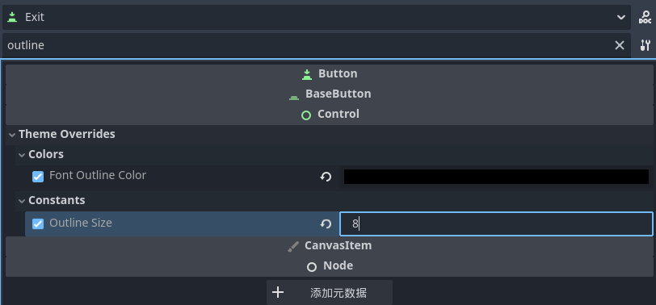
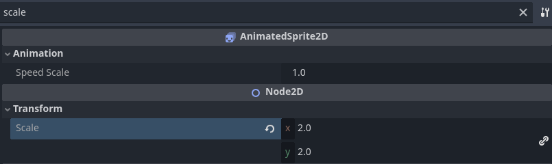
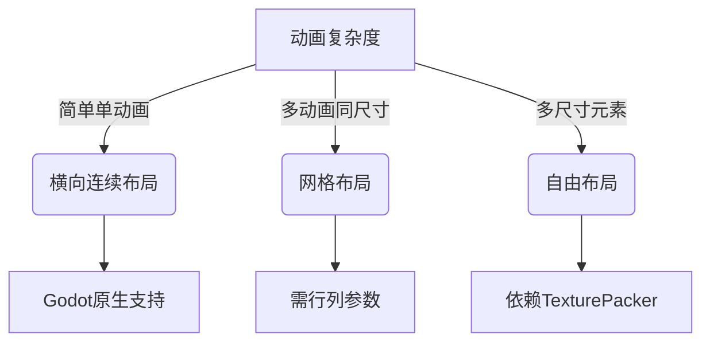

# Godot学习笔记

`文字描边功能`： 检查器----->Theme overrides ------>colors 修改文字描边颜色    constants 修改文字描边像素大小



`AnimatedSprite2D 修改缩放大小` ：检查器 ---> Transform ----> Scale 修改缩放比例




# 学习路线

### **一、Godot核心基础**

1. **引擎特性认知**
   - 节点（Node）与场景（Scene）架构 vs 传统GameObject/ECS
   - 信号（Signal）系统与观察者模式实现
   - 资源（Resource）的独特管理方式（`.tres`/`.tscn`）
2. **GDScript速成**
   - 与Python的语法差异（类型提示、`func`关键字）
   - 动态类型 vs 静态类型（`var` vs `var: int`）
   - 协程（`yield`/`await`）与多线程（`Thread`）
3. **2D开发专精**
   - 坐标系与变换（`Transform2D`）
   - 精灵（`Sprite2D`）与动画系统（`AnimationPlayer`/`AnimatedSprite2D`）
   - 物理系统（`RigidBody2D`/`KinematicBody2D`碰撞层管理）

------

### **二、游戏编程范式**

1. **架构设计模式**
   - 状态机实现角色控制（`match`语句+枚举）
   - 事件总线（`Autoload`单例）替代全局变量
   - 组合模式（`Area2D`+脚本复用）优于继承
2. **性能优化**
   - 视口（`Viewport`）渲染隔离技术
   - 对象池（`preload`+数组管理实例）
   - 着色器（`Shader`）优化粒子效果
3. **工具链集成**
   - 用VSCode调试GDScript（配置`launch.json`）
   - Git版本控制忽略规则（`.godot/`目录处理）
   - CI/CD自动化导出（Headless模式）

------

### **三、模块化实战项目**

#### **阶段1：2D平台游戏**

- 实现移动（`move_and_slide`）
- 相机控制（`Camera2D`的`drag_margin`）
- 可交互对象（`Area2D`+信号）

#### **阶段2：RPG对话系统**

- 解析JSON对话树
- 打字机效果（`RichTextLabel`+定时器）
- 分支选择UI动态生成

#### **阶段3：策略游戏地图**

- 六边形网格（`TileMap`自定义单元格）
- A*寻路（`AStar2D`类）
- 战争迷雾（`Light2D`+遮罩）

------

### **四、进阶方向选择**

1. **渲染专家**

   - 学习`CanvasLayer`深度管理
   - 编写自定义着色器（GLSL）
   - 2D光照系统（Normal Map应用）

2. **网络同步**

   - RPC调用（`@rpc`注解）
   - 帧同步 vs 状态同步
   - 延迟补偿技巧

3. **跨平台发布**

   - 移动端触控适配（`InputEventScreenTouch`）

   - WebAssembly导出限制

   - Steam SDK集成

     

# 组件

## Sprite2D


## CollisionShape2D 

 2D 物理碰撞形状节点

## **CollisionPolygon2D**

 **自定义多边形** 碰撞区域节点

手动绘制顶点，适用于不规则形状


# **FPS 计算逻辑**

Godot 的帧动画播放遵循以下规则：

- **每帧显示时间** = `1.0 / FPS`
- 例如：FPS=5 → 每帧显示 0.2 秒
- 三帧动画的完整循环时间 = `3 * (1.0 / FPS)`

如果有三帧动画 FPS设置为0.1 那么播放完3帧动画的时间就是 3 * （1(秒)/0.1）= 30s 每一帧播放速度就是 30 / 3  = 10s

- 总播放时间 ： 帧动画数量 * （1s/FPS数）


# **像素风格模糊解决方案**

将素材节点的texture属性改为Nearest


### **1. Inherit（继承）**

- **作用**：继承父节点的纹理过滤设置（如 `CanvasLayer` 或 `Viewport` 的默认设置）。
- **适用场景**：希望统一管理所有子纹理的过滤方式时。

------

### **2. Nearest（最近邻）**

- **原理**：直接取最近的纹理像素（无平滑处理）。
- **效果**：
  - 像素风格清晰，边缘锐利。
  - 放大时会出现明显锯齿。
- **适用场景**：
  - 像素艺术（Pixel Art）游戏。
  - 需要保留硬边缘的复古风格。

------

### **3. Linear（线性插值 / 双线性过滤）**

- **原理**：对相邻4个纹理像素进行插值混合。
- **效果**：
  - 纹理平滑，边缘略微模糊。
  - 放大时较柔和，但可能显得模糊。
- **适用场景**：
  - 高清纹理或3D模型。
  - 需要平滑过渡的非像素风格游戏。

------

### **4. Nearest Mipmap（最近邻 + Mipmap）**

- **原理**：
  - 使用预生成的缩小版纹理（Mipmap）。
  - 在每级 Mipmap 上使用 `Nearest` 采样。
- **效果**：
  - 远距离渲染时减少闪烁（Mipmap 的作用）。
  - 仍保留像素感。
- **适用场景**：
  - 像素风格游戏的远景物体。

------

### **5. Linear Mipmap（线性 + Mipmap / 三线性过滤）**

- **原理**：
  - 使用 Mipmap。
  - 在每级 Mipmap 上使用 `Linear` 插值。
  - 还会在相邻 Mipmap 层级之间进一步插值。
- **效果**：
  - 最平滑的远距离渲染。
  - 性能开销略高。
- **适用场景**：
  - 3D 游戏的主流选择。
  - 需要高质量纹理平滑的场景。

------

### **6. Nearest Mipmap Anisotropic（最近邻 + 各向异性过滤）**

- **原理**：
  - 结合 `Nearest Mipmap`。
  - 额外处理倾斜视角下的纹理失真（各向异性过滤）。
- **效果**：
  - 保留像素风格的同时，改善倾斜表面的纹理清晰度。
- **适用场景**：
  - 像素风格游戏的倾斜表面（如等角视角地图）。

------

### **7. Linear Mipmap Anisotropic（线性 + 各向异性过滤）**

- **原理**：
  - 结合 `Linear Mipmap`。
  - 额外启用各向异性过滤。
- **效果**：
  - 最高质量的纹理渲染。
  - 显著改善倾斜视角下的模糊问题。
- **适用场景**：
  - 3D 游戏的地面、墙壁等倾斜表面。
  - 需要极致画质的高清项目。

------

### **对比总结**

| 过滤模式                     | 平滑度 | 锯齿 | 性能开销 | 适用场景            |
| :--------------------------- | :----- | :--- | :------- | :------------------ |
| `Nearest`                    | 无     | 明显 | 最低     | 像素艺术            |
| `Linear`                     | 中等   | 无   | 低       | 普通2D/3D游戏       |
| `Nearest Mipmap`             | 无     | 中等 | 中       | 像素艺术 + 远景     |
| `Linear Mipmap`              | 高     | 无   | 中       | 标准3D游戏          |
| `Nearest Mipmap Anisotropic` | 无     | 中等 | 高       | 像素艺术 + 倾斜视角 |
| `Linear Mipmap Anisotropic`  | 最高   | 无   | 最高     | 高质量3D渲染        |

------

### **如何选择？**

1. **像素风格游戏**：
   - 主要用 `Nearest`。
   - 远景或倾斜视角可尝试 `Nearest Mipmap Anisotropic`。
2. **高清2D/3D游戏**：
   - 默认用 `Linear Mipmap`。
   - 地面/墙壁等倾斜表面用 `Linear Mipmap Anisotropic`。
3. **性能敏感场景**：
   - 优先用 `Linear` 或 `Nearest` 减少开销。

------

### **配置位置**

在 Godot 编辑器中：

1. 选中纹理资源（如 `.png`）。
2. 在 **Import** 面板中找到 **Filter** 选项。
3. 或直接在 `Sprite2D`/`TextureRect` 节点的属性中设置：

 

```
# 代码设置示例
$Sprite2D.texture_filter = CanvasItem.TEXTURE_FILTER_NEAREST
```

合理选择过滤模式可以显著提升画面表现！ 🎮

# 素材

网站分享：
https://itch.io/
https://www.spriters-resource.com/

ComfyUI工作流分享：
https://github.com/xiwan/comfyUI-workflows/
https://github.com/dimtoneff/ComfyUI-PixelArt-Detector

# 最佳目录实践

```
res://
├── assets/                  # 原始美术/音频资源（非直接使用）
│   ├── source_psd/          # Photoshop源文件
│   └── raw_sounds/          # 未处理的音频
│
├── audio/                   # 游戏使用的音频
│   ├── music/               # BGM（.ogg格式）
│   │   ├── main_menu.ogg    # 主界面音乐
│   │   └── gameplay/        # 游戏内BGM
│   └── sfx/                 # 音效（.wav短音效）
│       ├── ui/              # 界面音效（按钮点击等）
│       └── gameplay/        # 游戏内音效
│
├── characters/              # 角色相关
│   ├── player/              
│   │   ├── sprites/         
│   │   ├── animations/      
│   │   └── scripts/         
│   └── enemies/             
│       └── types/           # 按敌人类型分目录（如slime/, boss/）
│
├── levels/                  # 关卡设计
│   ├── level_01/            
│   │   ├── tilesets/        
│   │   └── level_01.tscn    
│   └── shared/              
│       ├── tilesets/        
│       └── props/           # 可复用的关卡道具
│
├── ui/                      # 用户界面
│   ├── main_menu/           # ★ 新增主界面目录
│   │   ├── MainMenu.tscn    # 主场景文件
│   │   ├── scripts/         # 主界面逻辑
│   │   ├── textures/        # 背景/按钮素材
│   │   ├── animations/      # 界面动画（如标题动态）
|   |  	└── locales/         # i18n语言文件
│   ├── fonts/               
│   ├── icons/              
│   ├── themes/              # 控件主题
│   └── hud/                 # 游戏内HUD（HUD是游戏中向玩家传达信息的视觉元素）
│       ├── health_bar.tscn  
│       └── minimap/         
│
├── scripts/                 
│   ├── utils/               # 工具类
│   │   ├── save_manager.gd  
│   │   └── audio_manager.gd # 音频控制单例
│   └── systems/             
│       ├── dialogue_system/ # 对话系统（含脚本和UI）
│       └── inventory/       # 背包系统
│
├── shaders/                 
│   ├── post_processing/     # 屏幕后效
│   └── sprite_effects/      # 角色特效
│
├── particles/               # 粒子效果预设
│   ├── weather/             # 雨雪等天气
│   └── combat/              # 战斗特效
│
└── autoload/                # 自动加载单例
    ├── GameManager.gd        # 游戏状态管理
    └── SceneLoader.gd        # 场景切换管理
```

最佳目录实践脚本 [create_godot_project.py](..\..\..\..\Project\Game\the-story-of-sword-forging\create_godot_project.py) 

```python
import os
from pathlib import Path
import sys

def create_godot_directory_structure(base_path="."):
    """生成完整的Godot 4.x项目目录结构"""
    
    # 完整目录结构（基于最佳实践）
    structure = [
        # 原始资源
        "assets/source_psd",
        "assets/raw_sounds",
        
        # 音频系统
        "audio/music/main_menu",
        "audio/music/gameplay",
        "audio/sfx/ui",
        "audio/sfx/gameplay",
        "audio/sfx/characters",
        
        # 角色系统
        "characters/player/sprites",
        "characters/player/animations",
        "characters/player/scripts",
        "characters/enemies/types/slime",
        "characters/enemies/types/boss",
        "characters/_shared/animations",
        
        # 关卡设计
        "levels/level_01/tilesets",
        "levels/level_01/scripts",
        "levels/_shared/tilesets",
        "levels/_shared/props",
        
        # 用户界面
        "ui/main_menu/textures",
        "ui/main_menu/scripts",
        "ui/main_menu/animations",
        "ui/hud",
        "ui/fonts",
        "ui/icons",
        "ui/themes",
        
        # 脚本系统
        "scripts/utils",
        "scripts/systems/dialogue_system",
        "scripts/systems/inventory",
        
        # 图形特效
        "shaders/post_processing",
        "shaders/sprite_effects",
        "particles/weather",
        "particles/combat",
        
        # 核心系统
        "autoload",
        
        # 测试相关
        "tests/unit",
        "tests/integration",
        
        # 本地化
        "localization/en",
        "localization/zh"
    ]

    # Godot特定文件内容模板
    templates = {
        ".gitignore": """# Godot 4.x
.godot/
import/
*.import
export.cfg
export_presets.cfg
""",
        "scripts/utils/singleton.gd": """extends Node
# 通用单例模式模板
class_name Singleton

static var instance: Singleton

func _init():
    if instance != null:
        push_error("Duplicate Singleton instance!")
    instance = self
""",
        "autoload/GameManager.gd": """extends Node
# 游戏状态管理器
class_name GameManager

signal level_changed(level_name)

var current_level := ""
var player_data := {}

func load_level(level_path: String):
    current_level = level_path
    get_tree().change_scene_to_file(level_path)
""",
        "ui/main_menu/MainMenu.tscn": """[gd_scene load_steps=2 format=3]

[ext_resource type="Script" path="res://ui/main_menu/scripts/MainMenu.gd" id="1"]

[node name="MainMenu" type="CanvasLayer"]
script = ExtResource("1")
"""
    }

    # 创建目录结构
    base_path = Path(base_path)
    created_count = 0
    
    print("🚀 Creating Godot project structure...")
    for folder in structure:
        full_path = base_path / folder
        try:
            full_path.mkdir(parents=True, exist_ok=True)
            print(f"📁 Created: {folder}")
            created_count += 1
        except Exception as e:
            print(f"❌ Failed to create {folder}: {str(e)}", file=sys.stderr)

    # 写入模板文件
    for file_path, content in templates.items():
        try:
            (base_path / file_path).write_text(content)
            print(f"📄 Created template: {file_path}")
            created_count += 1
        except Exception as e:
            print(f"❌ Failed to create {file_path}: {str(e)}", file=sys.stderr)

    # 创建默认项目.godot文件（Godot 4+）
    project_file = base_path / "project.godot"
    if not project_file.exists():
        project_file.write_text("""[application]

config/name="My Godot Project"
config/description="A new Godot 4 project"
config/icon="res://icon.png"

[autoload]

GameManager="*res://autoload/GameManager.gd"
""")
        print("📝 Created project.godot configuration")

    print(f"\n✅ Successfully created {created_count} items")
    print("\nNext steps:")
    print("1. Open this folder in Godot 4.x")
    print("2. Place your assets in the corresponding directories")
    print("3. Add your scenes and scripts to the existing structure")

def validate_path(path: str) -> Path:
    """验证并规范化路径"""
    path = Path(path).absolute()
    if not path.exists():
        raise ValueError(f"Path does not exist: {path}")
    if not os.access(path, os.W_OK):
        raise ValueError(f"No write permission for: {path}")
    return path

if __name__ == "__main__":
    try:
        print("=== Godot Project Structure Generator ===")
        default_path = os.getcwd()
        project_root = input(f"Enter project root path [{default_path}]: ").strip() or default_path
        
        validated_path = validate_path(project_root)
        create_godot_directory_structure(validated_path)
        
    except Exception as e:
        print(f"❌ Error: {str(e)}", file=sys.stderr)
        sys.exit(1)
```


# 角色动画基础动作中英文对照表

## 🏃 **基础移动动作（Basic Movement Actions）**

| **中文**  | **英文术语**    | **说明**                                             |
| :-------- | :-------------- | :--------------------------------------------------- |
| 待机/站立 | `Idle`          | 角色静止不动时的默认状态（可能包含呼吸或微小晃动）。 |
| 行走      | `Walk`          | 慢速移动，通常有摆臂或步伐动画。                     |
| 奔跑      | `Run`           | 快速移动，动作幅度更大（如身体前倾、大幅摆臂）。     |
| 冲刺      | `Dash`/`Sprint` | 短时间极速移动（可能伴随残影特效）。                 |
| 跳跃      | `Jump`          | 起跳瞬间的动画（需区分`Jump_Start`和`Jump_Apex`）。  |
| 下落      | `Fall`          | 角色在空中下降时的动画（可能伴随头发/衣物飘动）。    |
| 着陆      | `Land`          | 触地时的缓冲动作（如膝盖弯曲）。                     |
| 滑行/滑铲 | `Slide`         | 贴地滑行动作（常见于FPS或平台游戏）。                |

------

## 🔄 **方向性动作（Directional Variations）**

| **中文**   | **英文术语**                   | **说明**                                   |
| :--------- | :----------------------------- | :----------------------------------------- |
| 八方向移动 | `Walk_Up`, `Walk_Down_Left` 等 | 用后缀表示方向（如`_Up`, `_Down_Right`）。 |
| 后退行走   | `Walk_Backward`                | 角色向后移动（动作与前进不同）。           |
| 侧移       | `Strafe`                       | 横向移动（常见于射击游戏）。               |

------

## 🎮 **交互动作（Interaction Actions）**

| **中文**  | **英文术语**   | **说明**                                                     |
| :-------- | :------------- | :----------------------------------------------------------- |
| 攀爬      | `Climb`        | 攀爬梯子或悬崖的动作。                                       |
| 翻滚/闪避 | `Roll`/`Dodge` | 快速躲避攻击的动作。                                         |
| 蹲下/潜行 | `Crouch`       | 降低高度的移动状态（可能包含`Crouch_Idle`和`Crouch_Walk`）。 |
| 游泳      | `Swim`         | 水中移动（可细分`Swim_Idle`, `Swim_Fast`）。                 |

------

## ⚔️ **战斗相关动作（Combat Actions）**

| **中文**  | **英文术语**         | **说明**                                                |
| :-------- | :------------------- | :------------------------------------------------------ |
| 普通攻击  | `Attack1`, `Attack2` | 连击动画通常用数字区分阶段。                            |
| 受击      | `Hit`/`Hurt`         | 被攻击时的反应动画。                                    |
| 防御/格挡 | `Block`              | 举起武器或盾牌防御的动作。                              |
| 死亡      | `Death`              | 可细分多种死亡动画（如`Death_Fall`, `Death_Explode`）。 |

------

## 📝 **命名规范建议**

1. **前缀+动作名**（推荐）：
   - `Player_Run`（角色名+动作）
   - `Enemy_Attack`（敌人专用动作）
2. **状态机参数化**：
   - 用变量控制动作切换（如`velocity.x`切换`Idle/Walk/Run`）。
3. **混合动画**：
   - `Run_Shoot`（边跑边射击的混合动画）。

### 📌 **1. 基础命名结构**

#### (1) **角色/对象前缀 + 动作 + 变体**

- **格式**：`[角色类型]_[动作]_[方向/细节]`
- **示例**：
  - `Hero_Run_Left`（主角向左跑）
  - `Enemy_Goblin_Attack_Up`（哥布林敌人向上攻击）
  - `NPC_Dog_Bark`（NPC狗的吠叫动画）

**适用场景**：

- 角色类型多的项目（如RPG）
- 需要区分玩家/敌人/NPC动画时

#### (2) **动作分层命名**

- **格式**：`[动作]_[状态]_[附加条件]`
- **示例**：
  - `Jump_Start`（起跳瞬间）
  - `Jump_Fall`（下落阶段）
  - `Attack_Heavy_Charge`（重攻击蓄力）

**适用场景**：

- 复杂动作拆解（如格斗游戏）
- 需要精准控制动画阶段时

------

### 🌍 **2. 国际化与团队协作规范**

#### (1) **语言统一性**

- **强制规则**：
  - 全项目使用**英文命名**（避免中文拼音混杂，如`Pao` vs `Run`）。
  - 动作术语标准化（如统一用`Dash`而非`Sprint`）。

#### (2) **缩写规则**（针对长名称）

| **全称**     | **推荐缩写** | **错误示例** |
| :----------- | :----------- | :----------- |
| `Background` | `BG`         | `Back`       |
| `Animation`  | `Anim`       | `Ani`        |
| `Character`  | `Char`       | `Chr`        |

**示例**：`Char_Warrior_Anim_Idle`

------

### 🎮 **3. 技术适配型命名**

#### (1) **动画系统兼容性**

- **Godot动画树参数匹配**：

  gdscript

  

  复制

  

  下载

  ```
  # 命名与状态机参数直接关联
  if velocity.x != 0:
      anim_tree.set("parameters/Move/blend_position", velocity.x)
  ```

- **推荐命名**：

  - 状态机参数：`is_walking`, `attack_type`
  - 动画名称：`Anim_Player_Walk`（与参数逻辑对应）

#### (2) **骨骼动画专用规范**

- **骨骼层级标记**：
  - `Arm_L_Attack`（左手臂攻击骨骼动画）
  - `Hip_Turn_30deg`（髋关节旋转30度）

------

### 📂 **4. 文件与目录结构**

#### (1) **目录分类建议**

markdown


复制


下载

```
Assets/
├─ Animations/
│  ├─ Characters/
│  │  ├─ Hero/
│  │  │  ├─ Hero_Idle.anim
│  │  │  ├─ Hero_Run_Left.anim
│  │  ├─ Enemies/
│  │  │  ├─ Goblin_Attack.anim
│  ├─ UI/
│  │  ├─ Button_Hover.anim
```

#### (2) **版本控制友好命名**

- **避免**：`Final_Final_Anim_v3.anim`
- **推荐**：
  - 使用日期或提交哈希：`Hero_Jump_20240515.anim`
  - 语义化版本：`Hero_Jump_v1.0.0.anim`

------

### ⚠️ **5. 禁忌与常见错误**

1. **空格和特殊字符**：
   - ❌ `Player Run.anim` → ✅ `Player_Run.anim`
2. **大小写混乱**：
   - ❌ `heroAttack` → ✅ `Hero_Attack`（全团队统一用蛇形或驼峰）
3. **过度简写**：
   - ❌ `Ply_Rn_L` → ✅ `Player_Run_Left`

------

### 🛠️ **6. 自动化工具推荐**

1. **批量重命名工具**：

   - **ReNamer**（支持正则表达式）
   - **Godot插件**：[Animation Renamer](https://godotengine.org/asset-library/asset/999)

2. **命名检查脚本**（Python示例）：

   python

   

   复制

   

   下载

   ```
   # 检查文件名是否包含空格
   import os
   for file in os.listdir("Animations"):
       if " " in file:
           print(f"ERROR: Space found in {file}")
   ```

------

### 📊 **命名规范对比表**

| **分类**     | **松散命名**      | **规范命名**               | **优势**       |
| :----------- | :---------------- | :------------------------- | :------------- |
| **角色动作** | `run.anim`        | `Char_Hero_Run_Front.anim` | 避免资源冲突   |
| **骨骼动画** | `arm_move.anim`   | `Skel_Arm_L_Rotate.anim`   | 明确骨骼作用域 |
| **版本管理** | `attack_new.anim` | `Attack_v2.1.0.anim`       | 便于回滚和对比 |

------

### 💡 **终极建议**

- **文档化**：在项目Wiki中维护《动画命名公约》，包含示例和禁用列表。
- **早期强制**：在项目启动时约定规范，后期修改成本极高。
- **工具辅助**：用CI/CD自动化检查命名违规（如GitHub Actions）。

通过规范命名，团队协作效率可提升30%以上（尤其是跨美术/程序协作时）

# **纹理**

**本质**：纹理是一张存储在GPU内存中的**图像数据**，用于贴附到模型表面或2D精灵上，赋予其颜色、细节和材质感。


# 精灵和精灵表

精灵：

定义：精灵是2D游戏中的一个 **可渲染**对象，通常代表角色、敌人、道具或UI元素。

组成：一张纹理图片 可选的附加组件

精灵表：

定义：将多个精灵（通常是动画帧）合并到一张大图中的技术，也称为 **纹理图集（Texture Atlas）**

**典型结构**：

- **单行动画**：横向排列（如 `[帧1][帧2][帧3]`）。
- **网格动画**：多行多列（如4x4网格）。
- **自由排布**：不同尺寸的子图紧密排列（需元数据定位）。

**优势**：

- 减少GPU纹理切换（提升渲染性能）。
- 减少文件IO次数（加载1张大图 vs 多张小图）。

## 布局详解

### **一、主流精灵表布局类型**

#### 1. **横向连续布局（Single Row）**

- **结构**：单行排列所有帧

   **示例参数**：

  - 每帧尺寸：64x64
  - 总宽度：N×64，高度：64

- **适用场景**：

  - 简单动画（如8帧行走动画）
  - Godot原生快速导入（直接设置`Horizontal Frames=N`）

- **优势**：

  - 无需元数据文件，代码控制简单
  - 适合像素风小尺寸角色

#### 2. **网格布局（Uniform Grid）**

- **结构**：等尺寸帧按行列排列

   **Godot设置**：

  ```
  # 导入面板设置
  Texture → Sprite Sheet → Columns:4 / Rows:2
  ```

- **适用场景**：

  - 多动画整合（如角色待机/攻击/死亡动画在同一表）
  - 需要节省纹理空间的项目

- **优化技巧**：

  - 空帧用透明像素填充保持网格对齐

#### 3. **自由布局（Packed Layout）**

- **结构**：不同尺寸子图紧密排列

  ```
  [大图A][小图B]
     [长图C]
  ```

- **必要组件**：

  - 元数据文件（JSON/XML）记录每个子图坐标
  - 工具生成：TexturePacker/ShoeBox

- **适用场景**：

  - UI图标集（不同尺寸按钮/图标）
  - 复杂角色换装系统

#### 4. **分层布局（Multi-layer）**

- **结构**：不同部件分表存储

  ```
  res://characters/
      ├── body_sheet.png    # 基础身体
      ├── weapon_sheet.png  # 武器
      └── armor_sheet.png   # 装备
  ```

- **渲染逻辑**：

  ```
  # 代码组合绘制
  $Body.texture = body_sheet
  $Weapon.texture = weapon_sheet
  ```

- **优势**：

  - 支持运行时动态换装
  - 减少内存浪费（只加载可见部件）

### **二、布局选择决策树**



### **三、Godot最佳实践示例**

#### 案例：2D平台角色精灵表

1. **布局选择**：网格布局（4行 x 8列）

   - 每行一个动作：行走/跳跃/攻击/受伤

2. **导入设置**：

   ```
   # Import Dock配置
   Type: Texture2D
   Sprite Sheet: Enabled
   Columns:8 / Rows:4
   ```

3. **动画配置**：

   ```
   # 通过AnimationPlayer绑定帧
   var anim = $AnimationPlayer
   anim.add_animation("run", make_animation(0, 8)) # 第1行8帧
   anim.add_animation("jump", make_animation(8, 4)) # 第2行4帧
   ```

------

### **四、性能关键指标**

| 布局类型 | 内存占用 | Draw Call |   适用平台    |
| :------: | :------: | :-------: | :-----------: |
| 横向连续 |    低    |    低     | 移动端/低配PC |
| 网格布局 |    中    |    中     |    全平台     |
| 自由布局 |    高    |    高     |  中高配设备   |
| 分层布局 |   可变   |   可变    | 动态换装系统  |

------

### **五、避坑指南**

1. **尺寸陷阱**：

   - 避免非2的幂尺寸（如513x513），部分GPU会强制填充到1024x1024
   - 解决方案：用工具裁剪到512x512

2. **透明通道浪费**：

   - 纯矩形图标不要用PNG透明（改用JPG+遮罩）

    **跨平台问题**：

   - iOS设备对PVRTC压缩格式有要求

   - 在导出设置中启用平台专属压缩：

     ```
     Project → Export → iOS → Texture Format → PVRTC
     ```

# 动画

## 角色动画

### 1. **AnimationPlayer（关键帧动画）**

- **机制**：通过时间轴手动设置关键帧，对节点的属性（位置、旋转、缩放等）进行插值动画。支持缓动曲线调整过渡效果14。
- **适用场景**：
  - 预定义的固定动画（如角色漂浮、开门动画）。
  - 简单3D对象动画（如教程中的怪物上下浮动）1。
- **优缺点**：
  - ✅ 直观易用，适合初学者。
  - ❌ 动态切换动画需代码辅助，复杂状态管理困难。

------

### 🖼️2. **AnimatedSprite2D（序列帧动画）**

- **机制**：导入多张序列帧图片，按帧率播放。需通过脚本手动切换不同动画（如"idle"、"run"）45。
- **适用场景**：
  - 像素风或手绘风格的2D角色动画。
  - 轻量级项目（如平台跳跃游戏）4。
- **优缺点**：
  - ✅ 资源制作简单，适合美术资源驱动的动画。
  - ❌ 动画切换逻辑需自行编码，扩展性差。

------

### 🌲3. **动画树（AnimationTree + 状态机）**

- **机制**：
  - **动画树**：作为AnimationPlayer的控制器，支持混合多个动画（如走路到跑步的平滑过渡）。
  - **状态机**：定义动画状态（idle、run、attack）及转换条件（如速度>0时切到run）39。
- **适用场景**：
  - 需要动态响应游戏状态的复杂角色（如RPG主角）。
  - 方向性动画（八方向移动）3。
- **优缺点**：
  - ✅ 动画管理高度模块化，状态切换自动化。
  - ❌ 学习曲线较陡，需理解节点逻辑（如`BlendSpace1D/2D`）。

------

### 🦴 4. **骨骼动画（Skeleton2D/Skeleton3D）**

- **机制**：为角色绑定骨骼层级，通过控制骨骼运动驱动网格变形。可与AnimationPlayer结合制作关键帧骨骼动画27。
- **适用场景**：
  - 需要自然形变的2D/3D角色（如关节弯曲、肌肉拉伸）。
  - 使用Spine或Creature等工具导出的骨骼动画27。
- **优缺点**：
  - ✅ 动画更流畅，资源复用率高。
  - ❌ 配置复杂，需额外美术工具支持。

------

### ⏱️ 5. **Tween补间动画（程序化动画）**

- **机制**：通过代码实时生成属性过渡动画（如位移、旋转）。支持并行/串行动画链及缓动函数10。

- **适用场景**：

  - 简单程序动画（如UI弹窗、道具拾取）。
  - 动态路径动画（如电梯移动）106。

- **示例代码**：

   **优缺点**：

  - ✅ 灵活轻量，无需预定义资源。
  - ❌ 不适合复杂角色动画。

------

### 📊 **各方式应用广泛度对比**

下表总结了五种动画实现方式的核心特性与适用场景，帮助你根据项目需求快速选择：

| **动画实现方式**          | **适用场景**                     | **学习曲线** | **状态管理** | **应用广泛度** |
| :------------------------ | :------------------------------- | :----------- | :----------- | :------------- |
| **AnimationPlayer**       | 简单预定义动画、3D对象动画       | ⭐️⭐️           | 手动         | ⭐️⭐️⭐️⭐️           |
| **AnimatedSprite2D**      | 2D像素/手绘动画、轻量级项目      | ⭐️⭐️           | 手动         | ⭐️⭐️⭐️            |
| **动画树(AnimationTree)** | 复杂角色状态机、平滑过渡动画     | ⭐️⭐️⭐️⭐️         | 自动         | ⭐️⭐️⭐️⭐️⭐️          |
| **骨骼动画**              | 自然形变动画、专业美术流程       | ⭐️⭐️⭐️⭐️         | 结合其他     | ⭐️⭐️⭐️            |
| **Tween补间动画**         | 程序化过渡、UI动画、简单移动效果 | ⭐️⭐️⭐️          | 无           | ⭐️⭐️⭐️            |

> 💡 **应用最广泛的方式**：
> **AnimationPlayer + 动画树（AnimationTree）** 是Godot中角色动画的主流方案，尤其在需要状态机管理的项目中（如RPG、动作游戏）39。其优势在于：
>
> - **自动化状态切换**：通过条件（如速度、生命值）自动转换动画状态。
> - **平滑混合**：支持多个动画的权重混合（如边走边攻击）。
> - **社区资源丰富**：大量教程和案例（如B站教程）采用此方案39。

------

### 🎯 **选择建议**

- **独立开发者/小项目**：优先使用`AnimatedSprite2D`（2D）或`AnimationPlayer`（3D）4。
- **中大型项目/复杂角色**：必选**动画树+状态机**，长期维护成本更低39。
- **骨骼动画需求**：搭配Spine/Creature导出资源，并通过`AnimationPlayer`导入27。

# 场景加载方案

### **`change_scene_to_packed(packed_scene: PackedScene)`**

#### **工作原理**

- **参数**：接受一个已加载的 `PackedScene` 资源对象
- **流程**：
  1. 场景需要预先通过 `load()` 或 `preload()` 加载到内存
  2. 直接使用内存中的场景实例进行切换

#### **特点**

| 特性         | 说明                                |
| :----------- | :---------------------------------- |
| **性能**     | ✅ 更快（无磁盘I/O）                 |
| **内存**     | ❌ 需提前加载，占用更多内存          |
| **错误处理** | ❌ 如果PackedScene加载失败会直接报错 |
| **适用场景** | 频繁切换的小型场景（如UI界面）      |

#### **代码示例**

 

```
# 预先加载场景
var main_menu = preload("res://ui/main_menu.tscn")

# 切换场景
get_tree().change_scene_to_packed(main_menu)
```

------

### ** `change_scene_to_file(path: String)`**

#### **工作原理**

- **参数**：直接接受场景文件路径字符串
- **流程**：
  1. 运行时动态从磁盘加载场景
  2. 自动处理资源依赖

#### **特点**

| 特性         | 说明                                   |
| :----------- | :------------------------------------- |
| **性能**     | ❌ 稍慢（需实时加载）                   |
| **内存**     | ✅ 按需加载，更节省内存                 |
| **错误处理** | ✅ 自动处理路径错误（返回错误而非崩溃） |
| **适用场景** | 大型场景/按需加载（如关卡切换）        |

#### **代码示例**

 

```
# 直接通过路径切换
get_tree().change_scene_to_file("res://levels/level_1.tscn")
```

------

### **关键区别总结**

| 对比维度     | `change_scene_to_packed()` | `change_scene_to_file()` |
| :----------- | :------------------------- | :----------------------- |
| **参数类型** | `PackedScene` 对象         | 文件路径字符串           |
| **加载时机** | 需预先加载                 | 运行时动态加载           |
| **内存管理** | 常驻内存                   | 按需加载/卸载            |
| **执行速度** | 更快（无I/O）              | 稍慢（需读盘）           |
| **错误处理** | 立即报错                   | 返回加载状态             |
| **典型用途** | • 频繁切换的UI • 小型弹窗  | • 大型关卡 • 不常用场景  |

------

### **如何选择？**

1. **使用 `change_scene_to_packed` 当**：
   - 场景需要多次重复使用（如暂停菜单）
   - 追求极致切换速度
   - 能接受预加载的内存开销
2. **使用 `change_scene_to_file` 当**：
   - 场景较大或只使用一次（如不同关卡）
   - 需要动态加载不同场景
   - 内存敏感型项目

------

### **进阶技巧**

#### **混合使用模式**

 

```
# 预加载常用场景
@onready var common_scenes = {
    "menu": preload("res://ui/main_menu.tscn"),
    "hud": preload("res://ui/hud.tscn")
}

func switch_scene(scene_key: String):
    if scene_key in common_scenes:
        get_tree().change_scene_to_packed(common_scenes[scene_key])
    else:
        get_tree().change_scene_to_file("res://levels/%s.tscn" % scene_key)
```

#### **异步加载场景**

对于更大场景，推荐结合 `ResourceLoader.load_threaded_request()` 实现后台加载：

 根据项目需求合理选择这两种方法，可以显著优化游戏性能和内存管理！ 🚀

# 布局

 