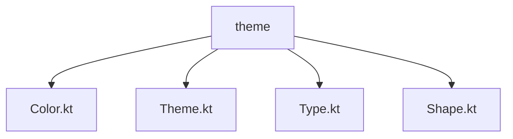
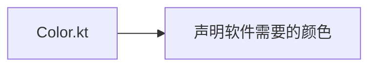
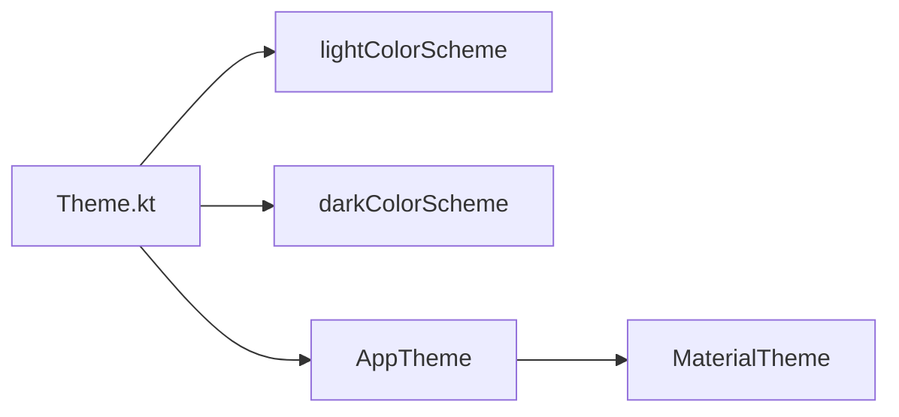
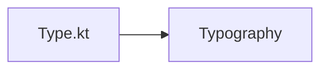
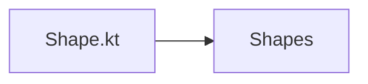
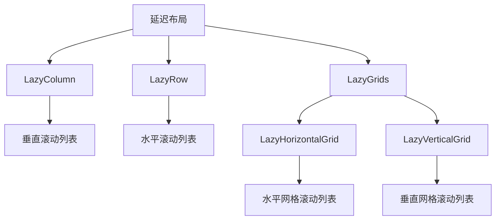

# 主题

首先在直接创建的compose项目下面存在theme文件夹，文件目录如下



## Color.kt




例如：这里这个文件声明了普通模式跟暗黑模式的所有颜色

```kotlin

val md_theme_light_primary = Color(0xFF825500)
val md_theme_light_onPrimary = Color(0xFFFFFFFF)
val md_theme_light_primaryContainer = Color(0xFFFFDDB3)
val md_theme_light_onPrimaryContainer = Color(0xFF291800)
val md_theme_light_secondary = Color(0xFF6F5B40)
val md_theme_light_onSecondary = Color(0xFFFFFFFF)
val md_theme_light_secondaryContainer = Color(0xFFFBDEBC)
val md_theme_light_onSecondaryContainer = Color(0xFF271904)
val md_theme_light_tertiary = Color(0xFF51643F)
val md_theme_light_onTertiary = Color(0xFFFFFFFF)
val md_theme_light_tertiaryContainer = Color(0xFFD4EABB)
val md_theme_light_onTertiaryContainer = Color(0xFF102004)
val md_theme_light_error = Color(0xFFBA1A1A)
val md_theme_light_errorContainer = Color(0xFFFFDAD6)
val md_theme_light_onError = Color(0xFFFFFFFF)
val md_theme_light_onErrorContainer = Color(0xFF410002)
val md_theme_light_background = Color(0xFFFFFBFF)
val md_theme_light_onBackground = Color(0xFF1F1B16)
val md_theme_light_surface = Color(0xFFFFFBFF)
val md_theme_light_onSurface = Color(0xFF1F1B16)
val md_theme_light_surfaceVariant = Color(0xFFF0E0CF)
val md_theme_light_onSurfaceVariant = Color(0xFF4F4539)
val md_theme_light_outline = Color(0xFF817567)
val md_theme_light_inverseOnSurface = Color(0xFFF9EFE7)
val md_theme_light_inverseSurface = Color(0xFF34302A)
val md_theme_light_inversePrimary = Color(0xFFFFB951)
val md_theme_light_shadow = Color(0xFF000000)
val md_theme_light_surfaceTint = Color(0xFF825500)
val md_theme_light_outlineVariant = Color(0xFFD3C4B4)
val md_theme_light_scrim = Color(0xFF000000)

val md_theme_dark_primary = Color(0xFFFFB951)
val md_theme_dark_onPrimary = Color(0xFF452B00)
val md_theme_dark_primaryContainer = Color(0xFF633F00)
val md_theme_dark_onPrimaryContainer = Color(0xFFFFDDB3)
val md_theme_dark_secondary = Color(0xFFDDC2A1)
val md_theme_dark_onSecondary = Color(0xFF3E2D16)
val md_theme_dark_secondaryContainer = Color(0xFF56442A)
val md_theme_dark_onSecondaryContainer = Color(0xFFFBDEBC)
val md_theme_dark_tertiary = Color(0xFFB8CEA1)
val md_theme_dark_onTertiary = Color(0xFF243515)
val md_theme_dark_tertiaryContainer = Color(0xFF3A4C2A)
val md_theme_dark_onTertiaryContainer = Color(0xFFD4EABB)
val md_theme_dark_error = Color(0xFFFFB4AB)
val md_theme_dark_errorContainer = Color(0xFF93000A)
val md_theme_dark_onError = Color(0xFF690005)
val md_theme_dark_onErrorContainer = Color(0xFFFFDAD6)
val md_theme_dark_background = Color(0xFF1F1B16)
val md_theme_dark_onBackground = Color(0xFFEAE1D9)
val md_theme_dark_surface = Color(0xFF1F1B16)
val md_theme_dark_onSurface = Color(0xFFEAE1D9)
val md_theme_dark_surfaceVariant = Color(0xFF4F4539)
val md_theme_dark_onSurfaceVariant = Color(0xFFD3C4B4)
val md_theme_dark_outline = Color(0xFF9C8F80)
val md_theme_dark_inverseOnSurface = Color(0xFF1F1B16)
val md_theme_dark_inverseSurface = Color(0xFFEAE1D9)
val md_theme_dark_inversePrimary = Color(0xFF825500)
val md_theme_dark_shadow = Color(0xFF000000)
val md_theme_dark_surfaceTint = Color(0xFFFFB951)
val md_theme_dark_outlineVariant = Color(0xFF4F4539)
val md_theme_dark_scrim = Color(0xFF000000)


val seed = Color(0xFF825500)

```

## Theme.kt




例如：LightColors变量，DarkColors变量都是将Color的颜色拿出来直接配置，AppTheme就

是设置应用的主题配置(动态主题，动态状态栏)

```kotlin
private val LightColors = lightColorScheme(
    primary = md_theme_light_primary,
    onPrimary = md_theme_light_onPrimary,
    primaryContainer = md_theme_light_primaryContainer,
    onPrimaryContainer = md_theme_light_onPrimaryContainer,
    secondary = md_theme_light_secondary,
    onSecondary = md_theme_light_onSecondary,
    secondaryContainer = md_theme_light_secondaryContainer,
    onSecondaryContainer = md_theme_light_onSecondaryContainer,
    tertiary = md_theme_light_tertiary,
    onTertiary = md_theme_light_onTertiary,
    tertiaryContainer = md_theme_light_tertiaryContainer,
    onTertiaryContainer = md_theme_light_onTertiaryContainer,
    error = md_theme_light_error,
    errorContainer = md_theme_light_errorContainer,
    onError = md_theme_light_onError,
    onErrorContainer = md_theme_light_onErrorContainer,
    background = md_theme_light_background,
    onBackground = md_theme_light_onBackground,
    surface = md_theme_light_surface,
    onSurface = md_theme_light_onSurface,
    surfaceVariant = md_theme_light_surfaceVariant,
    onSurfaceVariant = md_theme_light_onSurfaceVariant,
    outline = md_theme_light_outline,
    inverseOnSurface = md_theme_light_inverseOnSurface,
    inverseSurface = md_theme_light_inverseSurface,
    inversePrimary = md_theme_light_inversePrimary,
    surfaceTint = md_theme_light_surfaceTint,
    outlineVariant = md_theme_light_outlineVariant,
    scrim = md_theme_light_scrim,
)


private val DarkColors = darkColorScheme(
    primary = md_theme_dark_primary,
    onPrimary = md_theme_dark_onPrimary,
    primaryContainer = md_theme_dark_primaryContainer,
    onPrimaryContainer = md_theme_dark_onPrimaryContainer,
    secondary = md_theme_dark_secondary,
    onSecondary = md_theme_dark_onSecondary,
    secondaryContainer = md_theme_dark_secondaryContainer,
    onSecondaryContainer = md_theme_dark_onSecondaryContainer,
    tertiary = md_theme_dark_tertiary,
    onTertiary = md_theme_dark_onTertiary,
    tertiaryContainer = md_theme_dark_tertiaryContainer,
    onTertiaryContainer = md_theme_dark_onTertiaryContainer,
    error = md_theme_dark_error,
    errorContainer = md_theme_dark_errorContainer,
    onError = md_theme_dark_onError,
    onErrorContainer = md_theme_dark_onErrorContainer,
    background = md_theme_dark_background,
    onBackground = md_theme_dark_onBackground,
    surface = md_theme_dark_surface,
    onSurface = md_theme_dark_onSurface,
    surfaceVariant = md_theme_dark_surfaceVariant,
    onSurfaceVariant = md_theme_dark_onSurfaceVariant,
    outline = md_theme_dark_outline,
    inverseOnSurface = md_theme_dark_inverseOnSurface,
    inverseSurface = md_theme_dark_inverseSurface,
    inversePrimary = md_theme_dark_inversePrimary,
    surfaceTint = md_theme_dark_surfaceTint,
    outlineVariant = md_theme_dark_outlineVariant,
    scrim = md_theme_dark_scrim,
)

@Composable
fun AppTheme(
    //isSystemInDarkTheme判断系统是不是暗黑模式
    useDarkTheme: Boolean = isSystemInDarkTheme(),
    content: @Composable () -> Unit
) {

    //动态主题
    val context = LocalContext.current
    val colors = when {
        //只能在在安卓12以上实现
        (Build.VERSION.SDK_INT >= Build.VERSION_CODES.S) -> {
            //动态主题颜色 根据壁纸来设定
            if (useDarkTheme) dynamicDarkColorScheme(context)
            else dynamicLightColorScheme(context)
        }
        useDarkTheme -> DarkColors
        else -> LightColors
    }
    //动态状态栏
    val view = LocalView.current
    if (!view.isInEditMode) {
        SideEffect {
            val window = (view.context as Activity).window
            window.statusBarColor = colors.primary.toArgb()
            WindowCompat
                .getInsetsController(window, view)
                .isAppearanceLightStatusBars = useDarkTheme
        }
    }

    MaterialTheme(
        colorScheme = colors,
        typography = typography,
        content = content
    )
}
```

## Type.kt



例如：设置字体的样式

```kotlin
val typography = Typography(
    headlineSmall = TextStyle(
        fontWeight = FontWeight.SemiBold,
        fontSize = 24.sp,
        lineHeight = 32.sp,
        letterSpacing = 0.sp
    ),
    titleLarge = TextStyle(
        fontWeight = FontWeight.Normal,
        fontSize = 18.sp,
        lineHeight = 28.sp,
        letterSpacing = 0.sp
    ),
    bodyLarge = TextStyle(
        fontWeight = FontWeight.Normal,
        fontSize = 16.sp,
        lineHeight = 24.sp,
        letterSpacing = 0.15.sp
    ),
    bodyMedium = TextStyle(
        fontWeight = FontWeight.Medium,
        fontSize = 14.sp,
        lineHeight = 20.sp,
        letterSpacing = 0.25.sp
    ),
    labelMedium = TextStyle(
        fontWeight = FontWeight.SemiBold,
        fontSize = 12.sp,
        lineHeight = 16.sp,
        letterSpacing = 0.5.sp
    )
)
```

## Shape.kt



例如：

```kotlin
val shapes = Shapes(
    extraSmall = RoundedCornerShape(4.dp),
    small = RoundedCornerShape(8.dp),
    medium = RoundedCornerShape(16.dp),
    large = RoundedCornerShape(24.dp),
    extraLarge = RoundedCornerShape(32.dp)
)
```


# 延迟布局




# 动画

## animateContentSize


### tween

`tween` 函数用于创建基于时间线性变化的动画。它适用于简单的线性变化动画，可以通过调整持续时间和缓动函数来控制动画的速度和变化。

```kotlin
kotlinCopy codeimport androidx.compose.animation.core.tween

val animationSpec = tween(
    durationMillis = 500, // 动画持续时间为 500 毫秒
    easing = LinearOutSlowInEasing // 使用线性减速缓动函数
)
```

### spring

`spring` 函数用于创建弹簧动画，模拟了物理弹簧的效果。您可以通过调整 `stiffness` 和 `dampingRatio` 参数来控制弹簧的刚度和阻尼。

```kotlin
kotlinCopy codeimport androidx.compose.animation.core.spring

val animationSpec = spring(
    stiffness = Spring.StiffnessLow, // 弹簧刚度
    dampingRatio = Spring.DampingRatioLowBouncy // 阻尼比率
)
```

### keyframes

`keyframes` 函数用于创建关键帧动画，允许您根据时间线创建关键帧，并在不同的时间点设置不同的属性值。

```kotlin
kotlinCopy codeimport androidx.compose.animation.core.keyframes

val animationSpec = keyframes {
    durationMillis = 1000
    0f at 0 // 在时间 0 毫秒时，属性值为 0
    100f at 500 // 在时间 500 毫秒时，属性值为 100
    200f at 1000 // 在时间 1000 毫秒时，属性值为 200
}
```

### repeatable

`repeatable` 函数用于创建可重复的动画，您可以指定动画重复的次数以及重复模式（如逆向重复）。

```kotlin
kotlinCopy codeimport androidx.compose.animation.core.repeatable

val animationSpec = repeatable(
    iterations = 3, // 重复次数
    animation = tween(durationMillis = 300) // 动画配置
)
```

这些函数提供了不同类型的动画配置，您可以根据需求选择适合的动画效果。例如，对于简单的线性变化，可以使用 `tween`；对于弹簧效果，可以使用 `spring`；对于复杂的动画序列，可以使用 `keyframes`。

## Transition


# 状态

## viewModel

继承了viewModel的类都是一个模型，在那个类将所有的功能实现都使用列表的增删改查来实现，其他地方直接调用viewModel()方法获得这个模型，实现其功能

```kotlin
// 定义一个继承自 ViewModel 的类 WellnessViewModel
class WellnessViewModel : ViewModel() {
    // 注释：不直接从 ViewModel 外部暴露可变的任务列表。
    // 内部定义私有且可变的 _tasks，同时提供公开且只读的 tasks 属性。
    // 公开只读属性 tasks，返回 _tasks 的当前值
    private val _tasks = getWellnessTasks().toMutableStateList()
    val tasks: List<WellnessTask>
        get() = _tasks

    // 提供一个移除任务的方法，将指定的 WellnessTask 从内部的 _tasks 列表中删除
    fun remove(item: WellnessTask) {
        _tasks.remove(item)
    }

    // 提供一个改变任务状态的方法，找到与传入参数 item.id 相同的任务并将其 checked 状态设置为指定的布尔值 checked
    fun changeTaskChecked(item: WellnessTask, checked: Boolean) =
        tasks.find { it.id == item.id }?.let { task ->
            task.checked = checked
        }
}

// 私有辅助函数，用于生成包含 30 个 WellnessTask 对象的列表，每个对象的 id 和 description 都基于其在列表中的索引 i
private fun getWellnessTasks() = List(30) { i -> WellnessTask(i, "Task # $i") }

```

# 布局/组件

## Row

独占一行

## Column

独占一列

## Surface

独占一列

## Modifier

```
clip() 裁剪组件
background() 设置背景
clickable() 设置点击事件
```

## CompositionLocalProvider

用于在组合（composition）层次结构中提供本地化数据（称为 composition locals）。这些局部数据可以在组件树中任意位置被注入和消费，而无需通过props逐级传递。

## Scaffold

直译脚手架。槽位API，可以接受自行配置的子元素，不必公开子元素的每一个详细配置，会在界面留出空白区域，按照开发者自己的意愿来填充（就是先留坑，再填充详细组件）。Scaffold可以为最常见的顶级组件提供槽位，

```
topBar 顶部标题栏
content 内容填充
bottomBar 底部导航
floatingActionButton 悬浮按钮 
```

## Spacer

它用于在布局中占据一定大小的空间，不包含任何可见内容。它可以用来作为布局间距、填充空间或者帮助调整布局中其他组件的位置。


# ViewModel


## 界面控制器 (activity/fragment)

activity 和 fragment 是界面控制器。界面控制器通过在屏幕上绘制视图、捕获用户事件以及与用户与之互动的界面相关的所有其他操作来控制界面。应用中的数据或有关该数据的任何决策逻辑都不应放到界面控制器类中。

Android 系统可能会根据某些用户互动情况或因内存不足等系统条件而随时销毁界面控制器。由于这些事件不受您的控制，因此您不应将任何应用数据或状态存储到界面控制器中，而应将有关数据的决策逻辑添加到 `ViewModel` 中。

例如，在 **Unscramble** 应用中，乱序词、得分和单词数显示于 fragment（界面控制器）中，而决策代码（例如确定下一个乱序词）以及得分和单词数的计算则应位于 `ViewModel` 中。


## 介绍

[`ViewModel`](https://developer.android.google.cn/topic/libraries/architecture/viewmodel?hl=zh-cn) 是视图中显示的应用数据的模型。模型是负责处理应用数据的组件，能够让应用遵循架构原则，通过模型驱动界面。

[`ViewModel`](https://developer.android.google.cn/topic/libraries/architecture/viewmodel?hl=zh-cn) 存储应用相关的数据，这些数据不会在 Android 框架销毁并重新创建 activity 或 fragment 时销毁。在配置更改期间会自动保留 `ViewModel` 对象（不会像销毁 activity 或 fragment 实例一样将其销毁），以便它们存储的数据立即可供下一个 activity 或 fragment 实例使用


## 使用方式

先导入依赖

```kotlin
 implementation("androidx.lifecycle:lifecycle-viewmodel-ktx:2.6.1")
```


写一个继承ViewModel的类

```kotlin
//里面需要添加在视图上显示的一些变量或者方法

class MyViewModel : ViewModel() {
    
    private val users: MutableLiveData<List<User>> by lazy {
        MutableLiveData<List<User>>().also {
            loadUsers()
        }
    }

    fun getUsers(): LiveData<List<User>> {
        return users
    }

    private fun loadUsers() {
        // Do an asynchronous operation to fetch users.
    }
}
```

在Acivity里使用

```kotlin
class MainActivity : AppCompatActivity() {

    override fun onCreate(savedInstanceState: Bundle?) {
        super.onCreate(savedInstanceState)
        setContentView(R.layout.activity_main)
		
        val mainViewModel = ViewModelProvider(this).get(MyViewModel::class.java)
        mainViewModel.getUsers()

        //或者引入 extensions
        //implementation "android.arch.lifecycle:extensions:1.1.1"
        val mainViewModel = ViewModelProviders.of(this).get(MyViewModel::class.java);
    }

}
```

在Fragment里使用

```kotlin
class ItemFragment : Fragment() {

    var mainViewModel: MyViewModel? = null

    override fun onCreate(savedInstanceState: Bundle?) {
        super.onCreate(savedInstanceState)
        val mainViewModel = ViewModelProvider(requireActivity()).get(MyViewModel::class.java)
    }

    override fun onCreateView(
        inflater: LayoutInflater, container: ViewGroup?,
        savedInstanceState: Bundle?
    ): View? {
        val view = inflater.inflate(R.layout.fragment_item_list, container, false)
        return view
    }
}
```

在Composable里使用

```

```


# LiveData


# Room
