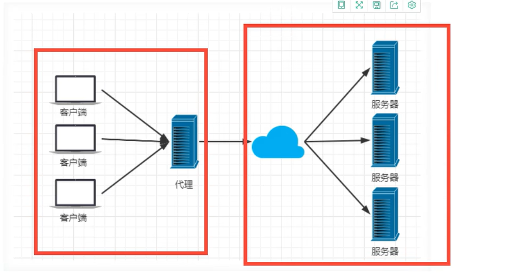
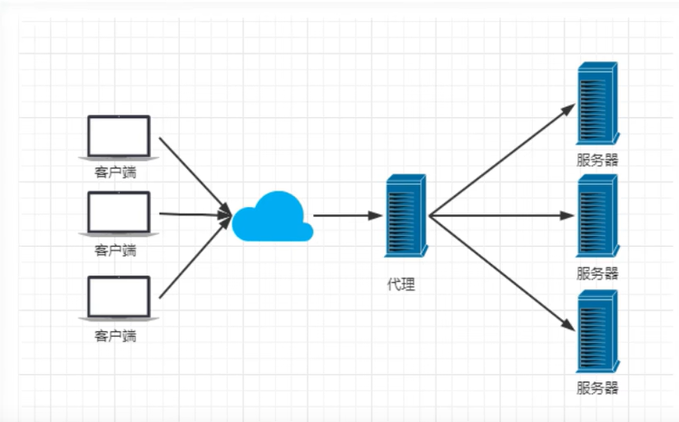
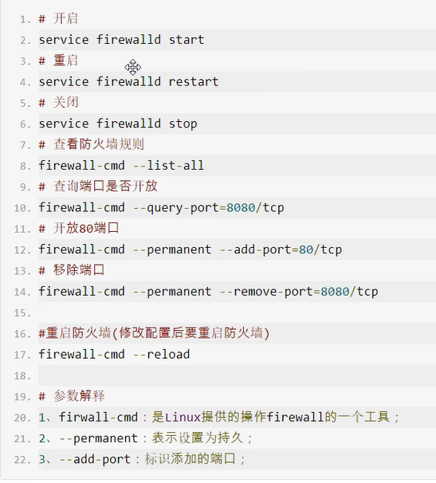
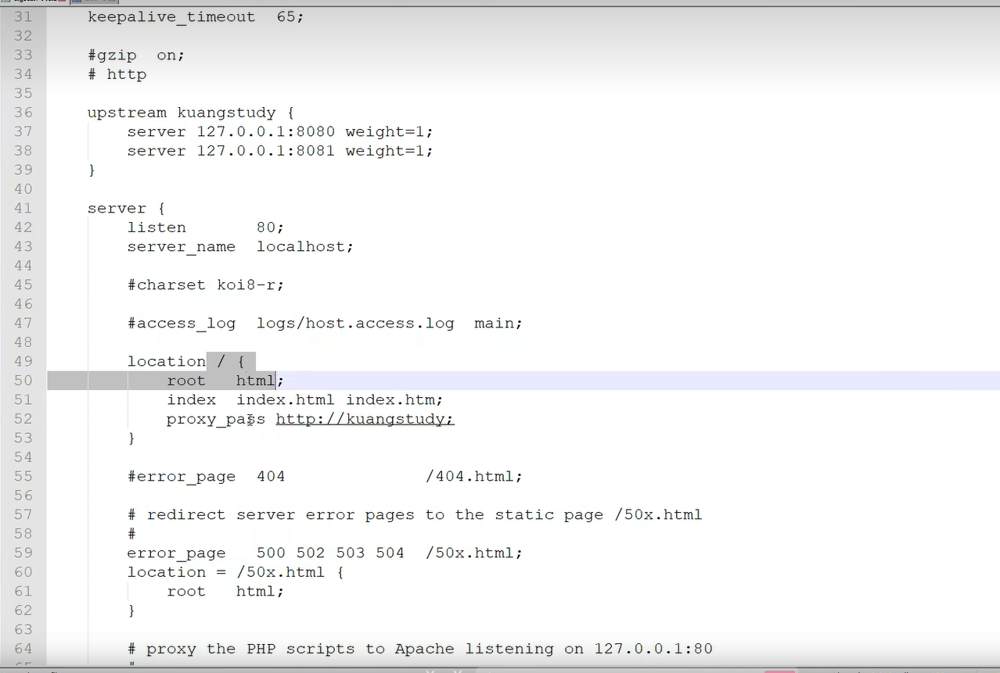

## 代理方式

正向代理 ：代理客户端



反向代理：代理服务端



## 负载均衡

内置两种：内置策略和扩展策略

内置策略就是：轮询和加权轮询（轮询就是所有服务器平均分配请求，加权轮询就是按照权重分配请求）


## session共享

自带：将客户端的请求ip进行hash操作 根据hash结果将客户端ip请求分发给同一台服务器

一般我们使用redis来实现session共享

## 动静分离

根据静态资源的特点将其做缓存处理。提高资源响应速度

## 基本命令

windows

nginx.exe --启动nginx

nginx -s stop --关闭nginx

nginx -s quit --安全退出

nginx -s reload --重新加载配置文件（重点）

关于Linux的防火墙配置



## nginx配置



```
upstream xxx{
server 127.0.0.1:8080 weight=1
server 127.0.0.1:8081 weight=1
#负载均衡
#这里的意思就是请求http://xxx 的根目录的时候再分发到 127.0.0.1的8080端口和8081端口
}

server{
	listen    80;#端口号
	server_name   location;#服务请求名称 

location / {
#配置本地请求
proxy_pass http://xxx
}

}
```

```
upstream webservers{#配置负载均衡
server 127.0.0.1:8080 weight=90 ;
server 127.0.0.1:8088 weight=10 ;
}

server {
listen       80;#配置端口号
server_name  localhost;#端口名称


location / {
root   html/sky;
index  index.html index.htm;
}

error_page   500 502 503 504  /50x.html;
location = /50x.html {
root   html;
}

# 反向代理,处理管理端发送的请求
location /api/ {
proxy_pass   http://localhost:8080/admin/;
#proxy_pass   http://webservers/admin/;
}

# 反向代理,处理用户端发送的请求
location /user/ {
proxy_pass   http://webservers/user/;
}

# WebSocket
location /ws/ {
proxy_pass   http://webservers/ws/;
proxy_http_version 1.1;
proxy_read_timeout 3600s;
proxy_set_header Upgrade $http_upgrade;
proxy_set_header Connection "$connection_upgrade";
}

```

