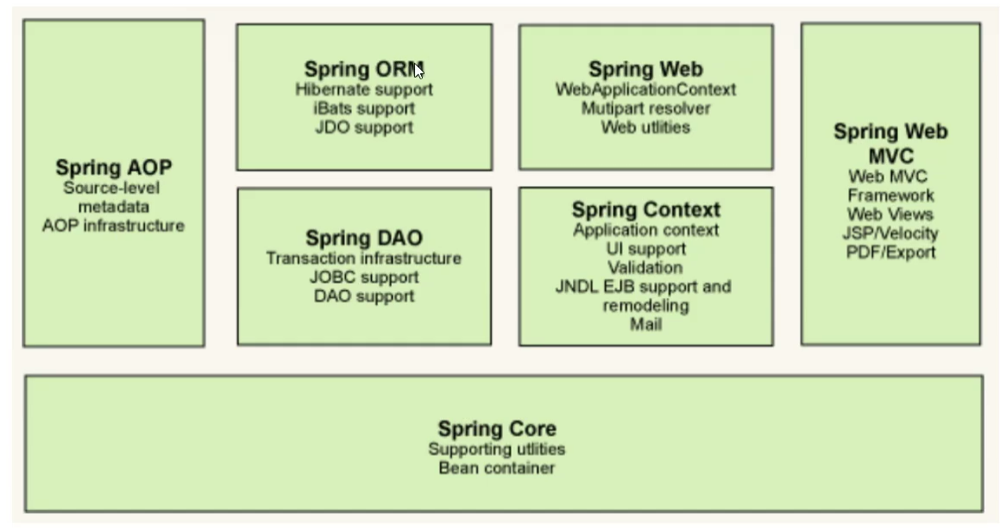
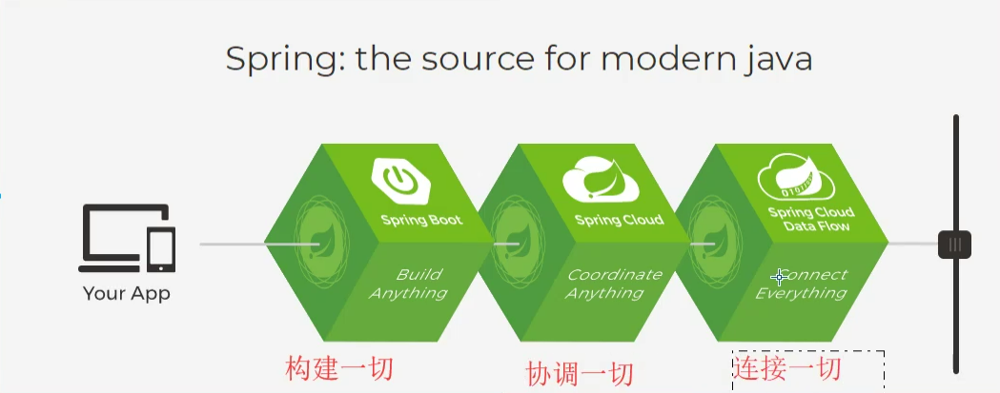
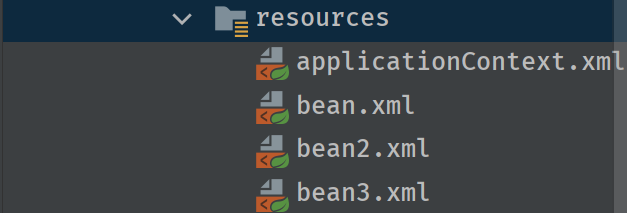
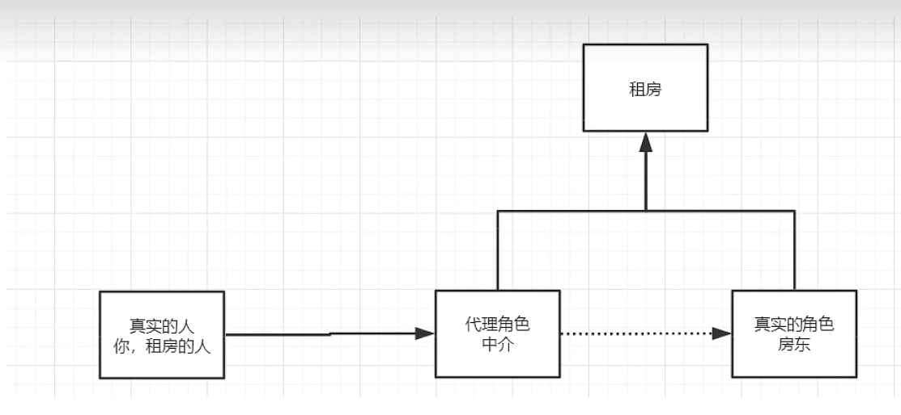

# 注解

- @Autowired 自动装配先通过类型，再通过名字，如果不能唯一自动装配上属性，则需要通过@Qualifier(value="xxx")来指定
- @Nullable：字段标记了这个注解，说明这个字段可以为null
- @Resource：自动装配名字，类型
- @Component：组件，放在类上，说明这个类被管理了

  - dao【@Repository//仓库】

  - service【@Service】

  - controller【@Controller】
- @Scope:在类上设置作用域


# 1.Spring

---

## 1.1简介

- Spring：春天

- ```xml
  <dependencies>
  		<!-- mysql 驱动-->
  		<dependency>
  			<groupId>mysql</groupId>
  			<artifactId>mysql-connector-java</artifactId>
  			<version>8.0.28</version>
  		</dependency>
  		<!-- Mybatis -->
  		<dependency>
  			<groupId>org.mybatis</groupId>
  			<artifactId>mybatis</artifactId>
  			<version>3.5.2</version>
  		</dependency>
  		<!-- Junit -->
  		<dependency>
  			<groupId>junit</groupId>
  			<artifactId>junit</artifactId>
  			<version>4.12</version>
  		</dependency>
  		<dependency>
  			<groupId>org.springframework</groupId>
  			<artifactId>spring-context</artifactId>
  			<version>5.3.18</version>
  		</dependency>
  		<dependency>
  			<groupId>org.springframework</groupId>
  			<artifactId>spring-core</artifactId>
  			<version>5.3.20</version>
  		</dependency>
  		<dependency>
  			<groupId>org.springframework</groupId>
  			<artifactId>spring-beans</artifactId>
  			<version>5.3.18</version>
  		</dependency>
  		<dependency>
  			<groupId>org.springframework</groupId>
  			<artifactId>spring-aop</artifactId>
  			<version>5.3.19</version>
  		</dependency>
  		<dependency>
  			<groupId>org.springframework</groupId>
  			<artifactId>spring-webmvc</artifactId>
  			<version>5.3.18</version>
  		</dependency>
  		<dependency>
  			<groupId>org.springframework</groupId>
  			<artifactId>spring-web</artifactId>
  			<version>6.0.3</version>
  		</dependency>
  		<dependency>
  			<groupId>org.springframework</groupId>
  			<artifactId>spring-expression</artifactId>
  			<version>5.3.22</version>
  		</dependency>
  		<dependency>
  			<groupId>org.springframework</groupId>
  			<artifactId>spring-aspects</artifactId>
  			<version>5.3.24</version>
  		</dependency>
  		<dependency>
  			<groupId>javax.servlet</groupId>
  			<artifactId>javax.servlet-api</artifactId>
  			<version>4.0.1</version>
  			<scope>provided</scope>
  		</dependency>
  		<dependency>
  			<groupId>org.aspectj</groupId>
  			<artifactId>aspectjweaver</artifactId>
  			<version>1.9.9.1</version>
  			<scope>runtime</scope>
  		</dependency>
  		<dependency>
  			<groupId>commons-logging</groupId>
  			<artifactId>commons-logging</artifactId>
  			<version>1.2</version>
  		</dependency>
  		<dependency>
  			<groupId>aopalliance</groupId>
  			<artifactId>aopalliance</artifactId>
  			<version>1.0</version>
  		</dependency>
  		<!-- jsp依赖 -->
  		<dependency>
  			<groupId>javax.servlet.jsp</groupId>
  			<artifactId>javax.servlet.jsp-api</artifactId>
  			<version>2.3.1</version>
  		</dependency>
  		<dependency>
  			<groupId>com.fasterxml.jackson.core</groupId>
  			<artifactId>jackson-core</artifactId>
  			<version>2.11.2</version>
  		</dependency>
  		<dependency>
  			<groupId>com.fasterxml.jackson.core</groupId>
  			<artifactId>jackson-databind</artifactId>
  			<version>2.11.2</version>
  		</dependency>
  		<dependency>
  			<groupId>com.fasterxml.jackson.core</groupId>
  			<artifactId>jackson-annotations</artifactId>
  			<version>2.11.2</version>
  		</dependency>
  	</dependencies>
  ```

  

## 1.2优点

- 开源免费框架

- 轻量级，非入侵的框架

- 控制反转（IOC），面向切面编程（AOP）

- 支持事物的处理，对框架整合的支持

  ==总结一句话：Spring就是一个轻量级的控制反转（IOC）和面向切面（AOP）编程的框架==

## 1.3组成



## 1.4拓展



现代化的Java开发

- ​	Spring boot
  - 一个快速开发的脚手架
  - 可以快速开发单个微服务
  - 约定大于配置
- Spring Cloud
  - 基于Spring boot实现

大部分公司都在使用SpringBoot进行快速开发

学习Springboot的前提就是Spring及SpringMVC

弊端：发展太久之后，违背了原来的理念，配置十分繁琐，人称“配置地狱”

# 2.IOC理论推导

spring-01-ioc1

2.1以前的实现方式

```
UserDao接口
UserDaoimpl实现类
UserSerivce业务接口
UserServiceimpl业务实现类
```

在上面的业务中，用户需求可能会影响我们原来的代码，我们需要根据用户的需求去修改源代码！

如果代码量十分大，修改一次的成本代价十分昂贵

我们使用一个Set接口实现

```java
private UserDao userDao;//之前这一句话直接new完整一个对象 对象就写死了

//利用Set进行动态实现值的注入
public void setUserDao(UserDao userDao){
	this.userDao = userDao;
}
```

- 之前，程序是主动创建对象！控制权在程序员手上
- 使用了set注入后，程序不再有主动性，而是变成了被动的接受对象！这些就是控制反转IOC

IOC本质

这种思想，从本质上解决了问题，我们程序员不用再去管理对象的创建了，系统耦合性降低，可以更加专注在业务的实现上！这是IOC原型！

**控制反转(inversion of control),** 是一种设计思想,DI(dependency injection依赖注入)是IOC的一种方法.未使用IOC的程序中,我们使用面向对象编程,对象的创建和对象之间的依赖关系完全硬编码在程序中,对象的创建是由程序自己控制的.控制反转就是将对象的创建转移给了第三方.IOC就我认为是:获得依赖对象的方式反转了

采用XML方式配置Bean的时候，Bean的定义信息是和实现分离的，而采用注解的方式可以把两者合为一体，Bean的定义信息直接以注解的形式定义在实现类中，从而达到了零配置的目的。

**控制反转是一种通过描述（XML或注解）并通过第三方去生产或获取特定对象的方式。在Spring中实现控制反转的是IoC容器，其实现方法是依赖注入（Dependency Injection,DI）。**

# 3.HelloSpring

spring-02-HelloSpring

创建一个类

Hello.java

```java
public class Hello {
    private String str;

    public String getStr() {
        return str;
    }

    public void setStr(String str) {
        this.str = str;
    }

    @Override
    public String toString() {
        return "Hello{" +
                "str='" + str + '\'' +
                '}';
    }
}

```

创建xml文件

applicationContext.xml(管理bean)

```xml
<?xml version="1.0" encoding="UTF-8" ?>
<beans xmlns="http://www.springframework.org/schema/beans"
       xmlns:xsi="http://www.w3.org/2001/XMLSchema-instance"
 xsi:schemaLocation="http://www.springframework.org/schema/beans
        http://www.springframework.org/schema/beans/spring-beans-3.0.xsd">
    <!--头文件固定-->
    <!-- 使用Spring来创建对象 ，在Spring这些都成为Bean -->
    <bean id="hello" class="com.enoch.pojo.Hello">
        <property name="str" value="Spring"></property>
    </bean>
</beans>

```

测试类

MyTest.java

```java
public class MyTest {
    public static void main(String[] args) {
        //获取Spring的上下文对象(获取容器)
        ApplicationContext context = new ClassPathXmlApplicationContext("applicationContext.xml");
        //所有bean保存到applicationContext文件里 我们不需要new 对象了 直接取出来；
        Hello hello = (Hello) context.getBean("hello");//获取容器指定内容
        System.out.println(hello.toString());

    }
}

```

# 4.IOC创建对象方式

spring-03-ioc2

1. 使用无参构造器创建对象，默认

   ```xml
         <bean id="user" class="com.enoch.pojo.User">
             <property name="name" value="enoch"/>
         </bean>
   ```

   

2. 假设我们需要使用有参构造器创建对象

   1. 下标赋值

      ```xml
      <!--有参构造创建方式 index代表第几个参数-->    
      <bean id="user" class="com.enoch.pojo.User">
              <constructor-arg index="0" value="enoch"/>
          </bean>   
      ```

      

   2. 数据类型赋值（不建议使用 如果有多个参数 为同一个类型就不行）

      ```xml
         <bean id="user" class="com.enoch.pojo.User">
              <constructor-arg type="java.lang.String" value="enoch"/>
          </bean>
      ```

      

   3. 直接使用bean中属性赋值

      ```xml
      <!--创建User -->  
      <bean id="user" class="com.enoch.pojo.User">
          <!--给User中的name赋值-->
              <constructor-arg name="name" value="enoch"/>
          </bean>
      ```

      注：在注册bean的时候就已经从创建了对象了 一直放在spring容器里 需要的时候再取
   
3. 使用注解

```java
@Bean
public AccountDao accountDao(){
    return new AccountDao();
}
```

让accountDao方法产生一个AccountDao 对象，然后这个AccountDao 对象交给Spring管理

@Bean注解和xml配置中的bean标签的作用是一样的。

==原因==：类似@Component , @Repository , @ Controller , @Service 这些注册Bean的注解存在局限性，只能局限作用于自己编写的类，如果是一个jar包==第三方库==要==加入IOC容器==的话，这些注解就手无缚鸡之力了，是的，@Bean注解就==可以做到==这一点！当然除了@Bean注解能做到还有@Import也能把第三方库中的类实例交给spring管理，而且@Import更加方便快捷，这里就不再概述。

# 5.Spring配置

spring-03-ioc2

## 5.1别名

```xml
<alias name="user" alias="bieminguser"/>
给user取一个别名 叫bieminguser
在getBean的时候 可以使用user 也可以使用 bieminguser
User user1 = (User) context.getBean("user");
等价
User user1 = (User) context.getBean("bieminguser");
```


## 5.2Bean的配置

```xml
id:bean唯一标识符 
class:bean所对应的全限定名
name:也是别名，name更高级 可以同时取多个别名 空格逗号分号分隔都行
scope:作用域
<bean id="user" class="com.enoch.pojo.User" name="user u2,u3;u4" >
    <constructor-arg name="name" value="enoch"/>
</bean>   
```


## 5.3import

这个一般用于团队开发，将多个配置文件导入合并为一个

项目有三个人开发

- 张三

- 李四

- 王五

  

这三个人负责不同的类开发 不同的类注册在不同的bean中



张三负责bean.xml

李四负责bean2.xml

王五负责bean3.xml

那么在applicationContext中直接import导入三个人的bean即可

```xml
<?xml version="1.0" encoding="UTF-8" ?>
<beans xmlns="http://www.springframework.org/schema/beans"
       xmlns:xsi="http://www.w3.org/2001/XMLSchema-instance"
       xsi:schemaLocation="http://www.springframework.org/schema/beans
        http://www.springframework.org/schema/beans/spring-beans-3.0.xsd">
    <import resource="bean.xml"/>
    <import resource="bean2.xml"/>
    <import resource="bean3.xml"/> 

</beans>
```

使用的时候直接使用applicationContext即可

# 6.DI依赖注入

spring-04-di

## 6.1构造器注入

前面已经讲过了（4.IOC创建对象方式）

## 6.2set方式注入（重点）

- 依赖注入：Set注入

  - 依赖:bean对象的创建依赖容器
  - 注入:bean对象的所有属性由容器来注入

  【环境搭建】

  1. 复杂类型（Address）
  2. 真实测试对象（Student）

  Student.java

  ```java
  package com.enoch.pojo;
  
  import java.util.*;
  
  /**
   * @author Enoch
   * @version testing0.1
   */
  public class Student {
      //IOC创建对象方式掌握 （依赖注入就是Bean赋值）
      private String name;
      private Address address;
  
      private String[] books;
      private List<String> hobbys;
      private Map<String, String> card;
      private Set<String> games;
      private Properties info;//配置类 学生信息
      private String wife;//空指针
  
      public String getName() {
          return name;
      }
  
      public void setName(String name) {
          this.name = name;
      }
  
      public Address getAddress() {
          return address;
      }
  
      public void setAddress(Address address) {
          this.address = address;
      }
  
      public String[] getBooks() {
          return books;
      }
  
      public void setBooks(String[] books) {
          this.books = books;
      }
  
      public List<String> getHobbys() {
          return hobbys;
      }
  
      public void setHobbys(List<String> hobbys) {
          this.hobbys = hobbys;
      }
  
      public Map<String, String> getCard() {
          return card;
      }
  
      public void setCard(Map<String, String> card) {
          this.card = card;
      }
  
      public Set<String> getGames() {
          return games;
      }
  
      public void setGames(Set<String> games) {
          this.games = games;
      }
  
      public Properties getInfo() {
          return info;
      }
  
      public void setInfo(Properties info) {
          this.info = info;
      }
  
      public String getWife() {
          return wife;
      }
  
      public void setWife(String wife) {
          this.wife = wife;
      }
  
      @Override
      public String toString() {
          return "Student{" +
                  "name='" + name + '\'' +
                  ", address=" + address +
                  ", books=" + Arrays.toString(books) +
                  ", hobbys=" + hobbys +
                  ", card=" + card +
                  ", games=" + games +
                  ", info=" + info +
                  ", wife='" + wife + '\'' +
                  '}';
      }
  }
  
  ```

  

Address.java

```java
package com.enoch.pojo;

/**
 * @author Enoch
 * @version testing0.1
 */
public class Address {
    private String address;

    public void setAddress(String address) {
        this.address = address;
    }
}


```

beans.xml

```xml
<?xml version="1.0" encoding="UTF-8" ?>
<beans xmlns="http://www.springframework.org/schema/beans"
       xmlns:xsi="http://www.w3.org/2001/XMLSchema-instance"
       xsi:schemaLocation="http://www.springframework.org/schema/beans
        http://www.springframework.org/schema/beans/spring-beans-3.0.xsd">
    <bean id="address" class="com.enoch.pojo.Address" name="address">
        <property name="address" value="北京"/>
    </bean>
    <bean id="student" class="com.enoch.pojo.Student" name="stu">
        <!--1.普通值注入-->
        <property name="name" value="小明"/>
        <!--2.bean注入 ref来注入-->
        <property name="address" ref="address"/>
        <!--3.数组注入-->
        <property name="books">
            <array>
                <value>红楼梦</value>
                <value>西游记</value>
                <value>水浒传</value>
                <value>三国演义</value>

            </array>
        </property>
        <!--4.list注入-->
        <property name="hobbys">
            <list>
                <value>听歌</value>
                <value>敲代码</value>
                <value>看电影</value>

            </list>
        </property>
        <!--4.map注入-->
        <property name="card">
            <map>
                <entry key="身份证" value="111111111111111111"/>
                <entry key="银行卡" value="111111111111111111"/>
            </map>
        </property>
        <!--5.set注入-->
        <property name="games">
            <set>
                <value>LOL</value>
                <value>COC</value>
                <value>BOB</value>
            </set>
        </property>
        <!--5.null注入-->
        <property name="wife">
            <null/>
        </property>
        <!--6.properties注入-->
        <property name="info">
            <props>
                <prop key="driver">20230412</prop>
                <prop key="url">localhost</prop>
                <prop key="username">root</prop>
                <prop key="password">123456</prop>
            </props>
        </property>


    </bean>
</beans>
```


MyTest.java

```java
/**
 * @author Enoch
 * @version testing0.1
 */
public class MyTest {
    public static void main(String[] args) {
        ApplicationContext context = new ClassPathXmlApplicationContext("beans.xml");
       Student stu = (Student) context.getBean("stu");
        System.out.println(stu.getName());
    }
}
//运行结果
Student{name='小明', address=Address{address='北京'}, books=[红楼梦, 西游记, 水浒传, 三国演义], hobbys=[听歌, 敲代码, 看电影], card={身份证=111111111111111111, 银行卡=111111111111111111}, games=[LOL, COC, BOB], info={password=123456, url=localhost, driver=20230412, username=root}, wife='null'}
```


## 6.3拓展方式

p命名空间注入，可以直接注入属性，值 properties

c命名空间注入，可以通过构造器注入属性，值 construct

c方式必须使用有参数构造器

使用需要导入约束

userBean.xml

```xml
<?xml version="1.0" encoding="UTF-8" ?>
<beans xmlns="http://www.springframework.org/schema/beans"
       xmlns:p="http://www.springframework.org/schema/p"
       xmlns:c="http://www.springframework.org/schema/c"
       xmlns:xsi="http://www.w3.org/2001/XMLSchema-instance"
       xsi:schemaLocation="http://www.springframework.org/schema/beans
        http://www.springframework.org/schema/beans/spring-beans-3.0.xsd">
    <!--p命名空间注入，可以直接注入属性，值 properties-->
    <bean id="user" class="com.enoch.pojo.User" p:name="小明" p:age="18"/>
    <!--c命名空间注入，可以通过构造器注入属性，值 construct-->
    <bean id="user2" class="com.enoch.pojo.User" c:age="17" c:name="小红"/>
</beans>
```

Test.java

```java
    @Test
    public void test2() {
        ApplicationContext context = new ClassPathXmlApplicationContext("userBean.xml");
        User user = (User) context.getBean("user2");
        System.out.println(user);
         User user = (User) context.getBean("user");
        System.out.println(user);
    }
```

## 6.4bean的作用域

<table>
    <tr><th>Scope</th></tr>
    <tr><td>singleton(重点)</td></tr>
    <tr><td>prototype(重点)</td></tr>
    <tr><td>request</td></tr>
    <tr><td>session</td></tr>
    <tr><td>application</td></tr>
    <tr><td>websocket</td></tr>
</table>

1.单例模式(spring默认机制)

```xml
<bean id="user" class="com.enoch.pojo.User" p:name="小明" p:age="18" scope="singleton"（默认）/>
```

2.原型模式(每一次从容器中get的时候都会产生一个新对象)

```xml
<bean id="user" class="com.enoch.pojo.User" p:name="小明" p:age="18" scope="prototype"/>
```

3.其余的request session application websocket 这些只能在web开发中使用

# 7.bean的自动装配

spring-05-Autowired

- 自动装配是spring满足bean依赖的一种方式
- spring会在上下文中自动寻找，并自动给bean装配属性

在spring中有三种自动装配方式

1. 在xml中显式配置
2. 在java中显式配置
3. 隐式自动装配bean（重点）

## 7.1测试

环境搭建：一个人有两只宠物

## 7.2自动装配

1.byName

 ```xml
     <bean id="cat" class="com.enoch.pojo.Cat"/>
     <bean id="dog" class="com.enoch.pojo.Dog"/>
 <!-- autowire="byName" 自动寻找 People类里面的Set方法 寻找与之对应的对象值  也就是这个id="dog" -->
     <bean id="People" class="com.enoch.pojo.People" autowire="byName">
         <property name="name" value="小红"/>
 ```

2.byType

必须保证装配的bean唯一

```xml
    <bean id="cat" class="com.enoch.pojo.Cat"/>
    <bean id="dog111" class="com.enoch.pojo.Dog"/>
<!-- autowire="byType" 自动寻找 People类里 寻找与之对应的对象属性相同的bean 也就是这个class="com.enoch.pojo.Dog"  -->
    <bean id="People" class="com.enoch.pojo.People" autowire="byType">
        <property name="name" value="小红"/>
```

小结：

- byName必须保证bean的id唯一，并且需要和自动注入的属性的set方法的值一致
- byType必须保证bean的class唯一，并且需要和自动注入的属性的类型一致 

## 7.3使用注解实现自动装配

要使用注解须知：

1. 导入约束:context约束

2. ==配置注解的支持：<context:annotation-config>==

3. ```xml
   <?xml version="1.0" encoding="UTF-8"?>
   <beans xmlns="http://www.springframework.org/schema/beans"
   xmlns:xsi="http://www.w3.org/2001/XMLSchema-instance" xmlns:context="http://www.springframework.org/schema/context" xsi:schemaLocation="http://www.springframework.org/schema/beans       https://www.springframework.org/schema/beans/spring-beans.xsd
   http://www.springframework.org/schema/context       https://www.springframework.org/schema/context/spring-context.xsd">
       <context:annotation-config/>
   </beans>
   ```

@Autowired

1. 在属性或set方法上使用 
2. 使用后可以忽略set方法 前提是自动装配属性在IOC容器中，且符合名字byname
3. 它其实是使用的==byType==的类似方法

科普

```
@Nullable  字段标记这个注解 说明这个字段可以为null
```

 

```java
public @interface Autowired {
	boolean required() default true;
}
```

测试代码

```java
public class People {
    //如果定义了required = false 说明这个对象可以为null，否则不允许为空
    @Autowired(required = false)
    private Cat cat;
    @Autowired
    private Dog dog;
    private String name;
    }
```

@Qualifier

其实就是==类似于byName==的方式 寻找id

如果注册了多个bean 并且id与类型都不匹配

可以与@Autowire搭配使用 寻找bean

```xml
    <bean id="cat1" class="com.enoch.pojo.Cat"/>
    <bean id="dog1" class="com.enoch.pojo.Dog"/>
    <bean id="cat111" class="com.enoch.pojo.Cat"/>
    <bean id="dog222" class="com.enoch.pojo.Dog"/>
    <bean id="People" class="com.enoch.pojo.People"/>
```

```java
	 //直接自动装配会出现错误   
	@Autowired
    private Cat cat;
    @Autowired
	@Qualifier(value="dog222")
    private Dog dog;
```

@Resource

集成了上面两个的功能

多个：先寻找id 是否有与属性相同的 如果不相同就去找class

寻找class的时候如果有多个（加个name属性来指定id）就会报错

```xml
如果满足名称相同 即使有多个直接寻找名称
    <bean id="cat" class="com.enoch.pojo.Cat"/>
    <bean id="dog" class="com.enoch.pojo.Dog"/>
    <bean id="cat111" class="com.enoch.pojo.Cat"/>
    <bean id="dog222" class="com.enoch.pojo.Dog"/>
如果只有两个 名称如果不相同他会自动寻找 class
 	<bean id="cat111" class="com.enoch.pojo.Cat"/>
    <bean id="dog222" class="com.enoch.pojo.Dog"/>
```

小结：@Resource和@Autowired的区别：

- 都是用来自动装配的，都可以放在属性字段上
- @Autowired 通过byType的方式来实现 而且必须要求这个对象存在！（常用）
- @Resource 通过byName的方式来实现 如果找不到名字就通过baType来实现，如果两个都找不到就报错（常用）
- 执行顺序不同：@Autowired 通过byType @Resource 通过byName

# 8.使用注解开发 

再spring4之后 要使用注解开发，必须保证aop的包导入

webmvc里面包含了基础依赖包

使用注解需要导入context约束

1.bean

@Component

2.属性如何注入

@Value

```java
@Component
//等价于<bean id="user" class="com.enoch.pojo.User"/>
//Component 组件
public class User {
    //相当于<property name="user" value="enoch1"/>
    @Value("enoch1")
    public String name;
}

```

3.衍生的注解

@Component有几个衍生注解，我们在web开发中，会按照mvc三层架构分层！功能都一样！

- dao【@Repository//仓库】
- service【@Service】
- controller【@Controller】

这四个功能一样，都是将某个类托管给Spring

4.自动装配

```
- @Autowired 自动装配先通过类型，再通过名字，如果不能唯一自动装配上属性，则需要通过@Qualifier(value="xxx")来指定
- @Nullable：字段标记了这个注解，说明这个字段可以为null
- @Resource：自动装配名字，类型
```

5.作用域

```java

@Component
//等价于<bean id="user" class="com.enoch.pojo.User"/>
//Component 组件
@Scope("prototype")
//设置作用域
public class User {
    //相当于<property name="user" value="enoch1"/>
    @Value("enoch1")
    public String name;
}

```

6.小结

xml和注解

1. xml更加万能，适用于任何场合，维护简单方便
2. 注解不是自己的类使用不了，维护相对复杂

最佳实践 

1. xml来管理bean

2. 注解只负责完成属性的注入

3. 我们在使用的过程中，只需要注意一个问题：必须让注解生效,就需要开启注解支持

   1. ```xml
          <context:component-scan base-package="com.enoch"/>
      
          <context:annotation-config/>
      ```

   

# 9.完全使用java配置Spring

spring-07-appconfig

我们现在完全不使用spring的xml配置了，全权交给java来做

javaConfig是Spring的一个子项目，再spring4之后成为核心功能  

```java
package com.enoch.pojo;

import org.springframework.beans.factory.annotation.Value;

public class User {
    public String name;

    public String getName() {
        return name;
    }
    @Value("enoch")
    public void setName(String name) {
        this.name = name;
    }

    @Override
    public String toString() {
        return "User{" +
                "name='" + name + '\'' +
                '}';
    }
}

```

```java
package com.enoch.config;

import com.enoch.pojo.User;
import org.springframework.context.annotation.Bean;
import org.springframework.context.annotation.ComponentScan;
import org.springframework.context.annotation.Configuration;
import org.springframework.context.annotation.Import;

@Configuration
//这个会被Spring托管 注册到容器中 它本身就是一个@Component，@Configuration代表这是一个配置类 就和我们看到的beans.xml一样
@ComponentScan//扫描包
@Import(MyConfig2.class)//导入其他bean
public class MyConfig {
    //注册一个bean 就相当于我们之前写的一个<bean id="getUser" class="com.enoch.pojo.User"/>
    //这个方法的名字就是 bean标签里面的id属性
    //这个方法的名返回值就是 bean标签里面的class属性
    @Bean
    public User getUser() {
        return new User();//就是返回要注入到bean的对象！

    }

}

```

```java
package com.enoch.config;

import org.springframework.context.annotation.Configuration;

@Configuration
public class MyConfig2 {
}
```

```java
import com.enoch.config.MyConfig;
import com.enoch.pojo.User;
import org.springframework.context.ApplicationContext;
import org.springframework.context.annotation.AnnotationConfigApplicationContext;

public class MyTest {
    public static void main(String[] args) {
        //如果完全用了javaconfig去做 我们就只能使用AnnotationConfigApplicationContext取读取config文件 获取容器
        ApplicationContext context = new AnnotationConfigApplicationContext(MyConfig.class);
        User user = context.getBean("getUser", User.class);
        System.out.println(user.getName());
    }
}

```

# 10.代理模式

SpringAOP底层



分类：

## 10.1静态代理

spring-08-proxy

角色分析

- 抽象角色：一般会使用接口或抽象类
- 真实角色：被代理的角色
- 代理角色：代理真实角色，代理角色后，一般会做附属操作
- 客户：访问代理的人

代码步骤

- 接口

```java
//租房
public interface Rent {
    public void rent();
}

```


- 真实角色

```java
//房东
public class Host implements Rent{

    @Override
    public void rent() {
        System.out.println("房东要出租房");
    }
}

```


- 代理角色

```java

public class Proxy {
    private Host host;
    public Proxy(){

    }
    public Proxy(Host host){
        this.host = host;
    }
    public void rent(){
        seeHouse();
        host.rent();
        hetong();
        fare();
    }
    //看房
    public void seeHouse(){
        System.out.println("中介带你看房");
    }
    //收费
    public void fare(){
        System.out.println("中介收费");
    }
    //签合同
    public void hetong(){
        System.out.println("中介签合同");
    }
}

```


- 客户端访问代理角色

```java
public class Client {
    public static void main(String[] args) {
        //房东要出租房子
        Host host1 =  new Host();
        //代理帮房东租房子 代理添加附属操作
        Proxy rent = new Proxy(host1);
        //找中介租房
        rent.rent();

    }
}

```

好处：

- 可以使真实角色操作更纯粹，不用去关注一些公共业务
- 公共也交给代理，实现业务分工
- 公共业务发生拓展的时候，方便集中管理

缺点：

- 一个真实角色就会产生一个代理角色 代码量会翻倍 开发效率会变低


## 10.2动态代理

- 动态代理和静态代理角色一样

- 动态代理的类是动态生成的，不是我们写好的

- 动态代理分为两大类：基于接口的动态代理 基于类的动态代理

  - 基于接口--JDK动态代理
  - 基于类--cglib
  - Java字节码：javasist

  需要了解两个类：proxy：代理  invocationHandler：调用处理程序

  **invocationHandler**

# 11.AOP

## 11.1 什么是 AOP

AOP （Aspect Orient Programming）,直译过来就是 面向切面编程。AOP 是一种编程思想，是面向对象编程（OOP）的一种补充。面向对象编程将程序抽象成各个层次的对象，而面向切面编程是将程序抽象成各个切面。

## 11.2 AOP 术语

- Aspect（切面）: 一个跨越多个类的关注点的模块化。事务管理是企业级Java应用中横切关注点的一个很好的例子。在Spring AOP中，切面是通过使用常规类（基于 [schema 的方法](https://springdoc.cn/spring/core.html#aop-schema)）或使用 `@Aspect` 注解的常规类（[@AspectJ](https://springdoc.cn/spring/core.html#aop-ataspectj) 风格）实现的。
- Join point: 程序执行过程中的一个点，例如一个方法的执行或一个异常的处理。在Spring AOP中，一个连接点总是代表一个方法的执行。
- Advice: 一个切面在一个特定的连接点采取的行动。不同类型的advice包括 "around"、"before" 和 "after" 的advice（Advice 类型将在后面讨论）。许多AOP框架，包括Spring，都将advice建模为一个拦截器，并在连接点（Join point）周围维护一个拦截器链。
- Pointcut: 一个匹配连接点的谓词（predicate）。advice与一个切点表达式相关联，并在切点匹配的任何连接点上运行（例如，执行一个具有特定名称的方法）。由切点表达式匹配的连接点概念是AOP的核心，Spring默认使用AspectJ的切点表达式语言。
- Introduction: 代表一个类型声明额外的方法或字段。Spring AOP允许你为任何 advice 的对象引入新的接口（以及相应的实现）。例如，你可以使用引入来使一个bean实现 `IsModified` 接口，以简化缓存。（介绍在AspectJ社区中被称为类型间声明）。
- Target object: 被一个或多个切面所 advice 的对象。也被称为 "advised object"。由于Spring AOP是通过使用运行时代理来实现的，这个对象总是一个被代理的对象。
- AOP proxy: 一个由AOP框架创建的对象，以实现切面契约（advice 方法执行等）。在Spring框架中，AOP代理是一个JDK动态代理或CGLIB代理。
- Weaving（织入）: 将aspect与其他应用程序类型或对象连接起来，以创建一个 advice 对象。这可以在编译时（例如，使用AspectJ编译器）、加载时或运行时完成。Spring AOP和其他纯Java AOP框架一样，在运行时进行织入。

Spring AOP包括以下类型的advice。

- Before advice: 在连接点之前运行的Advice ，但它不具备以下能力 阻止执行流进行到 join point 的能力（除非它抛出一个异常）。
- After returning advice: 在一个连接点正常完成后运行的Advice （例如，如果一个方法返回时没有抛出一个异常）。
- After (finally) advice: 无论连接点以何种方式退出（正常或特殊返回），都要运行该advice。
- Around advice: 围绕一个连接点的advice，如方法调用。这是最强大的一种advice。Around advice可以在方法调用之前和之后执行自定义行为。它还负责选择是否继续进行连接点或通过返回自己的返回值或抛出一个异常来缩短advice方法的执行。

## 11.3 使用Spring实现AOP

【重点】使用AOP织入，需要导入一个依赖包！

```xml
<!-- https://mvnrepository.com/artifact/org.aspectj/aspectjweaver -->
<dependency>
    <groupId>org.aspectj</groupId>
    <artifactId>aspectjweaver</artifactId>
    <version>1.9.4</version>
</dependency>

```

```
 1、execution()：表达式主体。

 2、第一个*号：表示返回类型，*号表示所有的类型。

 3、包名：表示需要拦截的包名，后面的两个句点分别表示当前包和当前包的所有子包，com.sample.service.impl包、子孙包下所有类的方法。

 4、第二个*号：表示类名，*号表示所有的类。

 5、*(..) ：第三个星号表示方法名，*号表示所有的方法，后面括弧里面表示方法的参数，两个句点表示任何参数。

下面给出一些常见切入点表达式的例子： 借鉴(https://smallbee.iteye.com/blog/2213078)

execution (* com.sample.service.impl.*.*(..))
```

### 方式1：使用Spring的API接口（主要使用SpringAPI接口实现）

UserService

```java
package com.enoch.service;

import org.springframework.stereotype.Component;

@Component
public interface UserService {
    public void add(int i);

    public void delete(int i,int j);

    public void update(int i,int j,int k);

    public void select(int i,int j,int k,int p);

}

```

UserserviceImpl

```java
package com.enoch.service;

import org.springframework.stereotype.Component;

@Component
public class UserServiceImpl implements UserService {
    @Override
    public void add(int i) {
        System.out.println("增加了一个用户");
    }

    @Override
    public void delete(int i, int j) {
        System.out.println("删除了一个用户");

    }

    @Override
    public void update(int i, int j, int k) {
        System.out.println("更改了一个用户");

    }

    @Override
    public void select(int i, int j, int k, int p) {
        System.out.println("查询了一个用户");

    }
}

```

Log

```java
package com.enoch.log;

import org.springframework.aop.AfterAdvice;
import org.springframework.aop.MethodBeforeAdvice;
import org.springframework.stereotype.Component;

import java.lang.reflect.Method;
@Component
public class Log implements MethodBeforeAdvice{
    //method 要执行目标对象的方法
    //args 参数
    //target 目标对象
    @Override

    public void before(Method method, Object[] args, Object target) throws Throwable {
        System.out.println(target.getClass().getName()+"的"+method.getName()+"被执行了");
    }
}

```


Afterlog

```java
package com.enoch.log;


import org.springframework.aop.AfterReturningAdvice;
import org.springframework.stereotype.Component;

import java.lang.reflect.Method;
@Component
public class AfterLog implements AfterReturningAdvice {
    @Override
    public void afterReturning(Object returnValue, Method method, Object[] args, Object target) throws Throwable {
        System.out.println("执行了"+method.getName()+"返回结果为"+returnValue);
    }
}

```

```java
MyTest
import com.enoch.service.UserService;
import org.springframework.context.ApplicationContext;
import org.springframework.context.support.ClassPathXmlApplicationContext;

public class MyTest {
    public static void main(String[] args) {
        ApplicationContext context = new ClassPathXmlApplicationContext("applicationContext.xml");
        //动态代理代理的是接口
        UserService user = context.getBean("userService", UserService.class);
        user.add(1);
        user.delete(1, 2);
        user.update(1, 2, 3);
        user.select(1, 2, 3, 4);


    }
}

```

applicationContext.xml

```xml
<?xml version="1.0" encoding="UTF-8"?>
<beans xmlns="http://www.springframework.org/schema/beans"
       xmlns:xsi="http://www.w3.org/2001/XMLSchema-instance"
       xmlns:context="http://www.springframework.org/schema/context"
       xmlns:aop="http://www.springframework.org/schema/aop"
       xsi:schemaLocation="http://www.springframework.org/schema/beans
       https://www.springframework.org/schema/beans/spring-beans.xsd
       http://www.springframework.org/schema/context
       https://www.springframework.org/schema/context/spring-context.xsd
       http://www.springframework.org/schema/aop
       https://www.springframework.org/schema/aop/spring-aop.xsd">

    <bean id="userService" class="com.enoch.service.UserServiceImpl"/>
    <bean id="log" class="com.enoch.log.Log"/>
    <bean id="afterLog" class="com.enoch.log.AfterLog"/>
    <!--配置AOP-->
    <!-- 方式一：使用原生-->
        <aop:config>
            <!--切入点:   expression:表达式，execution(要执行的位置！* * * * *)-->
            <aop:pointcut id="pointcut" expression="execution(void com.enoch.service.*.add(..) )"/>
            <!--执行环绕增加-->
            <aop:advisor advice-ref="log" pointcut-ref="pointcut"/>
            <aop:advisor advice-ref="afterLog" pointcut-ref="pointcut"/>
        </aop:config>
        </beans>
```

### 方式2：使用自定义类来实现AOP(主要是切面定义)

DiyPointCut

```java
package com.enoch.diy;

public class DiyPointCut {
    public void before(){
        System.out.println("方法执行前");
    }
    public void after(){
        System.out.println("方法执行后");
    }
}

```

applicationContext.xml

```xml
   <?xml version="1.0" encoding="UTF-8"?>
<beans xmlns="http://www.springframework.org/schema/beans"
       xmlns:xsi="http://www.w3.org/2001/XMLSchema-instance"
       xmlns:context="http://www.springframework.org/schema/context"
       xmlns:aop="http://www.springframework.org/schema/aop"
       xsi:schemaLocation="http://www.springframework.org/schema/beans
       https://www.springframework.org/schema/beans/spring-beans.xsd
       http://www.springframework.org/schema/context
       https://www.springframework.org/schema/context/spring-context.xsd
       http://www.springframework.org/schema/aop
       https://www.springframework.org/schema/aop/spring-aop.xsd">
   <bean id="diy" class="com.enoch.diy.DiyPointCut"/>
    <aop:config>
        <!--自定义切面**通知 -->
        <aop:aspect ref="diy">
            <!--切入面-->
            <aop:pointcut id="point" expression="execution(* com.enoch.service.UserServiceImpl.*(..) )"/>
            <aop:before method="before" pointcut-ref="point"/>
            <aop:after method="after" pointcut-ref="point"/>
        </aop:aspect>
    </aop:config>
    </beans>
```

### 方式3：使用注解实现AOP

# 12.整合Mybatis

步骤

1. 导入jar包

   1. junit
   2. mybatis
   3. mysql数据库
   4. spring相关
   5. aop织入
   6. mybatis-spring

   ```xml
   <dependency>
               <groupId>org.springframework</groupId>
               <artifactId>spring-webmvc</artifactId>
               <version>5.1.9.RELEASE</version>
           </dependency>
           <dependency>
               <groupId>junit</groupId>
               <artifactId>junit</artifactId>
               <version>4.13.1</version>
               <scope>test</scope>
           </dependency>
           <dependency>
               <groupId>mysql</groupId>
               <artifactId>mysql-connector-java</artifactId>
               <version>8.0.28</version>
           </dependency>
           <dependency>
               <groupId>org.mybatis</groupId>
               <artifactId>mybatis</artifactId>
               <version>3.5.2</version>
           </dependency>
           <!--用Spring操作数据库的话还需要 spring-jdbc -->
           <dependency>
               <groupId>org.springframework</groupId>
               <artifactId>spring-jdbc</artifactId>
               <version>5.1.9.RELEASE</version>
           </dependency>
           <dependency>
               <groupId>org.aspectj</groupId>
               <artifactId>aspectjweaver</artifactId>
               <version>1.9.7</version>
           </dependency>
          <dependency>
               <groupId>org.mybatis</groupId>
               <artifactId>mybatis-spring</artifactId>
               <version>2.0.6</version>
           </dependency>
   ```

   

2. 编写配置文件

3. 测试

### 12.1回忆Mybatis

1. 编写实体类
2. 编写核心配置文件
3. 编写接口
4. 编写Mapper.xml
5. 测试

### 12.2Mybatis-spring骨架

```xml
<?xml version="1.0" encoding="UTF-8" ?>
<!DOCTYPE configuration
        PUBLIC "-//mybatis.org//DTD Config 3.0//EN"
        "https://mybatis.org/dtd/mybatis-3-config.dtd">
<configuration>

</configuration>
```


1. 编写数据源

```xml
    <!--Datasource:使用Spring的数据源替换Mybatis的配置 c3p0 dbcp druid
    我们这里使用Spring提供的JDBC :org.springframework.jdbc.datasource.DriverManagerDataSource
    -->
    <bean id="dataSource" class="org.springframework.jdbc.datasource.DriverManagerDataSource">
        <property name="driverClassName" value="com.mysql.cj.jdbc.Driver"/>
        <property name="url" value="jdbc:mysql://localhost:3306/test?useUnicode=true\
  &amp;characterEncoding=utf-8&amp;serverTimezone=Asia/Shanghai"/>
        <property name="username" value="root"/>
        <property name="password" value="gshmily020921"/>
    </bean>
```


1. sqlSessionFactoy

```xml
    <!--sqlSessionFactory-->
    <bean id="sqlSessionFactory" class="org.mybatis.spring.SqlSessionFactoryBean">
        <property name="dataSource" ref="dataSource"/>
        <!--        绑定mybatis配置文件-->
        <property name="configLocation" value="classpath:mybatis-config.xml"/>
        <property name="mapperLocations" value="classpath:com/enoch/mapper/*.xml"/>
    </bean>
```


1. sqlSessiontemplate

```xml
<!--SqlSessionTemplate就是我们使用的sqlssion-->
    <bean id="sqlSession" class="org.mybatis.spring.SqlSessionTemplate">
        <!--构造器注入-->
        <constructor-arg index="0" ref="sqlSessionFactory"/>
    </bean>
```


1. 需要给接口加实现类

接口

```java
package com.enoch.mapper;

import com.enoch.pojo.User;

import java.util.List;

public interface UserMapper {
    public List<User> selectUser();

}

```

实现类

```java
package com.enoch.mapper;

import com.enoch.pojo.User;
import org.mybatis.spring.SqlSessionTemplate;

import java.util.List;

public class UserMapperImpl implements UserMapper {
    //以前我们的所有操作都用sqlSession来执行
    //现在使用sqlSessionTemplate
    private SqlSessionTemplate sqlSession;

    public UserMapperImpl(SqlSessionTemplate sqlSession) {
        this.sqlSession = sqlSession;
    }

    public UserMapperImpl() {
    }

    public void setSqlSession(SqlSessionTemplate sqlSession) {
        this.sqlSession = sqlSession;
    } 

    @Override
    public List<User> selectUser() {
        return sqlSession.getMapper(UserMapper.class).selectUser();
    }


}

```

mapper

```xml
<?xml version="1.0" encoding="UTF-8" ?>
<!DOCTYPE mapper
        PUBLIC "-//mybatis.org//DTD Config 3.0//EN"
        "https://mybatis.org/dtd/mybatis-3-mapper.dtd">
<mapper namespace="com.enoch.mapper.UserMapper">
    <select id="selectUser" resultType="User">
        select * from mybatis.user;
    </select>
</mapper>
```


1. 将自己写的实现类，注入到spring

```xml 
    <bean id="userMapper" class="com.enoch.mapper.UserMapperImpl">
        <property name="sqlSession" ref="sqlSession"/>
    </bean>
```

```xml
<bean id="userMapper2" class="com.enoch.mapper.UserMapperImpl2">
        <property name="sqlSessionFactory" ref="sqlSessionFactory"/>
    </bean>
这里这种方法不需要注入selSession 而是直接注入sqlSessionFactory 比上面少了一步 下面是他的实现类


```

```java

public class UserMapperImpl2 extends SqlSessionDaoSupport implements UserMapper {
    @Override
    public List<User> selectUser() {
        return getSqlSession().getMapper(UserMapper.class).selectUser();
    }
}
```

# 13.声明式事务

### 1.回顾事务

- 把一组业务当成一个业务来做：要么都成功，要么都失败
- 事务在项目开发中，十分重要，涉及到数据一致性问题，不能马虎
- 确保完整性和一致性

事务的ACID原则

- A原子性
- C一致性
- I隔离性

  - 多个业务可能操作同一个资源，防止数据损坏
- D持久性

  - 事务一旦提交，无论	系统发生什么问题，结果都不会被影响，被持久化的写到储存器中


### 2.springz中的事务管理

- 声明式事务：AOP

```xml
 <!--配置声明式事务-->
    <bean id="transactionManager" class="org.springframework.jdbc.datasource.DataSourceTransactionManager">
        <constructor-arg ref="dataSource"/>
    </bean>
    <!--结合AOP实现事务的织入-->
    <!--    配置事务通知-->
    <tx:advice id="txAdvice" transaction-manager="transactionManager">
        <!--        给那些方法配置事务-->
        <!--        配置事务的传播特性：new propagation-->
        <tx:attributes>
            <tx:method name="add" propagation="REQUIRED"/>
            <tx:method name="delete " propagation="REQUIRED"/>
            <tx:method name="update " propagation="REQUIRED"/>
            <tx:method name="query " read-only="true"/>
            <tx:method name="*"/>
        </tx:attributes>
    </tx:advice>
    <!--    配置事务切入-->
    <aop:config>
        <aop:pointcut id="txPointCut" expression="execution(* com.enoch.mapper.*.*(..))"/>
        <aop:advisor advice-ref="txAdvice" pointcut-ref="txPointCut"/>
    </aop:config>
```


- 编程式事务：需要在代码中

