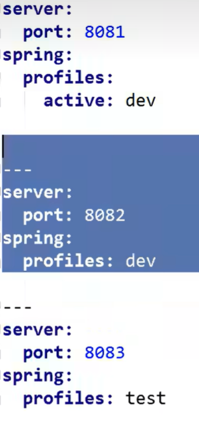
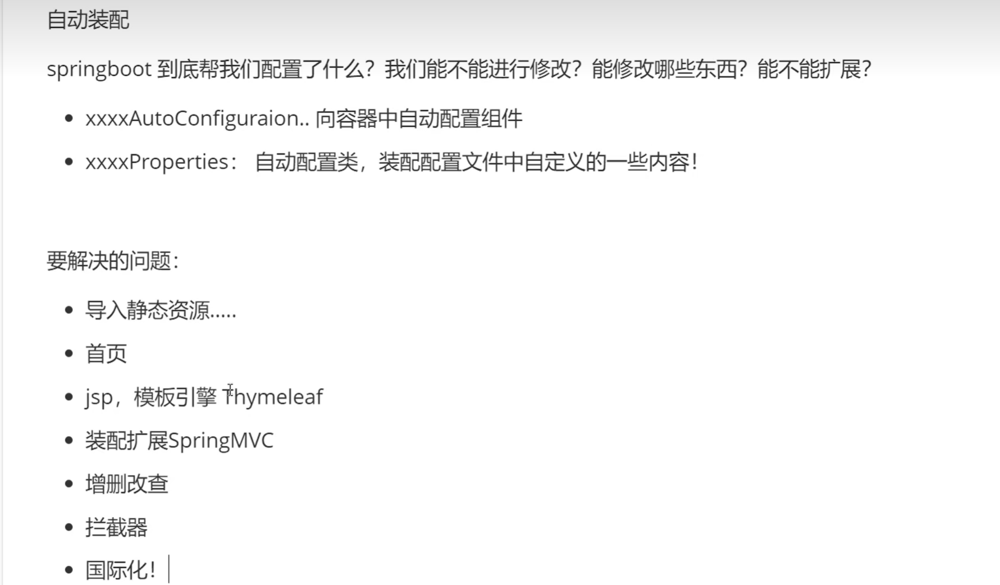

#  目标

Springboot是什么

配置如何编写yaml

自动装配原理（重要）

集成web开发

集成数据库Druid

分布式开发：Dubbo+zookeeper

swagger：接口文档

任务调度

SpringSecurity：Shiro （拦截器）


## 微服务阶段

论文：[Martin Fowler微服务论文翻译-KuangStudy-文章](https://www.kuangstudy.com/bbs/1364150595472072706)

新服务架构:服务网格！

mvc三辰架构 mvvm架构 微服务架构

它就是一种架构

# 第一个SpringBoot

- jdk1.8
- maven 3.6.1
- springboot:最新
- IDEA

官方：提供了一个快速生成的网站！IDEA集成了这个网站

- 第一种方式直接在官网生成 导入idea 官方快速生成springboot**[Spring Initializr](https://start.spring.io/)**
- 第二种方式 IDEA里面new一个Spring Initializr项目（平时开发就这个）

 

建包必须跟主程序在同一级目录 


打了jar包可以直接运行，前后端分离

## 更改配置

application.properties（配置文件）添加 

banner图 直接在配置文件同级目录添加一个banner.txt文件即可

# 原理

### pom.xml

- spring-boot-dependencies:核心依赖在父工程中
- 不需要写版本是因为有版本仓库

### 启动器

- ```xml
  <dependency>
      <groupId>org.springframework.boot</groupId>
      <artifactId>spring-boot-starter-web</artifactId>
  </dependency>
  ```

  

- ```xml
  <dependency>
      <groupId>org.springframework.boot</groupId>
      <artifactId>spring-boot-starter-web</artifactId>
  </dependency>
  ```

  

- ```xml
  <dependency>
      <groupId>org.springframework.boot</groupId>
      <artifactId>spring-boot-starter-test</artifactId>
      <scope>test</scope>
  </dependency>
  ```

  

启动器:其实就是SpringBoot的启动场景

比如spring-boot-starter-web，它就会帮我们导入所有web环境依赖	

springboot会将所有功能场景都变成启动器

### 主程序

@SpringBootApplication：标注一个类为springboot的应用

SpringApplication.*run*(SpringBootOneApplication.class, args):将springboot启动

#### 注解

```
@SpringBootConfiguration：springboot的配置
	@Configuration：配置类
		@Component：组件

@EnableAutoConfiguration：自动配置	
	@AutoConfigurationPackage：自动配置包
		@Import({AutoConfigurationPackages.Registrar.class})：自动配置`包注册`
	@Import({AutoConfigurationImportSelector.class})：自动配置导入选择	
```

# yaml/yml


语法

```
属性: 值
#冒号后面必须有空格 否则是错误语法
```

在实体类中加上注解@ConfigurationProperties(prefix = "person")

prefix 后面绑定的就是yaml对应的属性名字

```java
@ConfigurationProperties(prefix = "person")
public class Person {
    private String name;
    private Integer age;
    private Boolean happy;
    private Date birth;
    private Map<String, Objects> maps;
    private List<Objects> lists;
    private Dog dog;
}
```

```yaml
person:
  name: enoch
  age: 3
  happy: false
  brith: 2023/5/19
  maps: {k1:v1,k2:v1}
  list:
    - code
    - music
    - girl
  dog:
    name: 旺财
    age: 11

```

## 松散绑定

就是在yaml中使用短横线连接的名称 能对应java驼峰命名属性

比如

```
yaml

last-name

java

lastName
```

再绑定的时候能够绑定上值




# JSR303校验

注解@validated//数据校验


在java属性上面加上注解 在注入值的时候要是不满足格式就不会被注入

# SpringBoot Web开发



