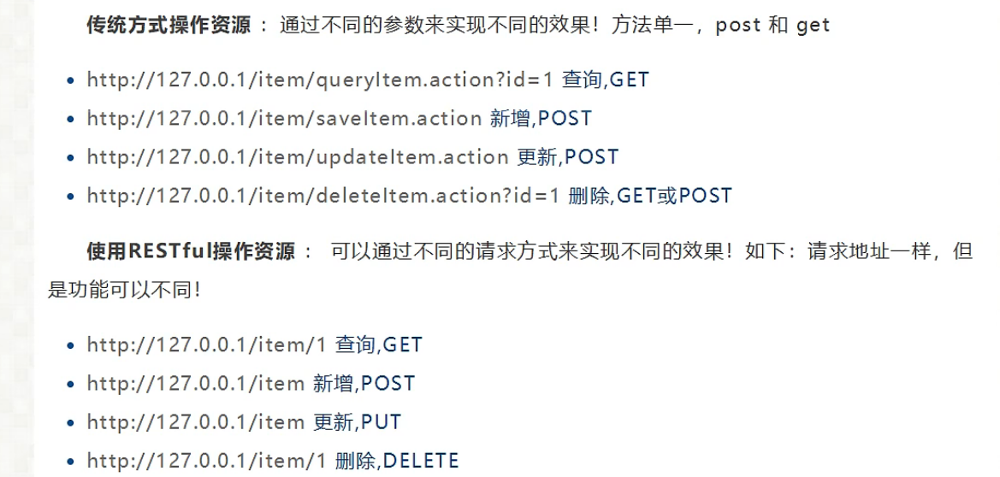
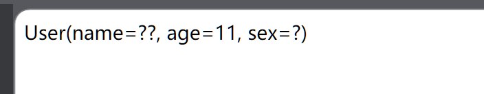
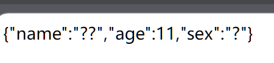

# SpringMVC 

# 依赖

```xml
<project xmlns="http://maven.apache.org/POM/4.0.0" xmlns:xsi="http://www.w3.org/2001/XMLSchema-instance"
  xsi:schemaLocation="http://maven.apache.org/POM/4.0.0 http://maven.apache.org/maven-v4_0_0.xsd">
  <modelVersion>4.0.0</modelVersion>
  <groupId>com.yc</groupId>
  <artifactId>springmvc</artifactId>
  <packaging>war</packaging>
  <version>0.0.1-SNAPSHOT</version>
  <name>springmvc Maven Webapp</name>
  <url>http://maven.apache.org</url>
  <properties>
    	<project.build.sourceEncoding>UTF-8</project.build.sourceEncoding>
		<maven.compiler.encoding>UTF-8</maven.compiler.encoding>
		<spring.version>4.1.4.RELEASE</spring.version>
  </properties>
  
 <dependencies>
    <dependency>
      <groupId>junit</groupId>
      <artifactId>junit</artifactId>
      <version>4.11</version>
      <scope>test</scope>
    </dependency>
    <!-- https://mvnrepository.com/artifact/org.aopalliance/com.springsource.org.aopalliance -->
    <dependency>
      <groupId>org.aspectj</groupId>
      <artifactId>aspectjweaver</artifactId>
      <version>1.9.3</version>
    </dependency>
    <!--Jsp依赖-->
    <dependency>
      <groupId>javax.servlet.jsp</groupId>
      <artifactId>javax.servlet.jsp-api</artifactId>
      <version>2.3.3</version>
    </dependency>
    <!--aop整合依赖-->
    <dependency>
      <groupId>aopalliance</groupId>
      <artifactId>aopalliance</artifactId>
      <version>1.0</version>
    </dependency>
    <dependency>
      <groupId>org.aspectj</groupId>
      <artifactId>aspectjweaver</artifactId>
      <version>1.9.5</version>
    </dependency>
    <dependency>
      <groupId>org.springframework</groupId>
      <artifactId>spring-aop</artifactId>
      <version>5.0.10.RELEASE</version>
    </dependency>
    <dependency>
      <groupId>org.springframework</groupId>
      <artifactId>spring-aspects</artifactId>
      <version>5.1.0.RELEASE</version>
    </dependency>
    <!--spring-beans-->
    <dependency>
      <groupId>org.springframework</groupId>
      <artifactId>spring-beans</artifactId>
      <version>5.0.1.RELEASE</version>
    </dependency>
    <dependency>
      <groupId>org.springframework</groupId>
      <artifactId>spring-context</artifactId>
      <version>5.0.1.RELEASE</version>
    </dependency>
    <dependency>
      <groupId>org.springframework</groupId>
      <artifactId>spring-core</artifactId>
      <version>5.0.1.RELEASE</version>
    </dependency>
    <dependency>
      <groupId>org.springframework</groupId>
      <artifactId>spring-expression</artifactId>
      <version>5.0.1.RELEASE</version>
    </dependency>
    <dependency>
      <groupId>org.springframework</groupId>
      <artifactId>spring-jcl</artifactId>
      <version>5.0.1.RELEASE</version>
    </dependency>
    <!--jdbc-->
    <dependency>
      <groupId>org.springframework</groupId>
      <artifactId>spring-jdbc</artifactId>
      <version>5.0.1.RELEASE</version>
    </dependency>
    <dependency>
      <groupId>org.springframework</groupId>
      <artifactId>spring-tx</artifactId>
      <version>5.0.1.RELEASE</version>
    </dependency>
    <!--
    spring-web-5.0.1.RELEASE.jar
    spring-webmvc-5.0.1.RELEASE.jar
    MyBatis的jar包
    MyBatis和Spring整合的jar包
    mybatis-spring-1.3.1.jar
    -->
    <dependency>
      <groupId>org.springframework</groupId>
      <artifactId>spring-web</artifactId>
      <version>5.0.1.RELEASE</version>
    </dependency>
    <dependency>
      <groupId>org.springframework</groupId>
      <artifactId>spring-webmvc</artifactId>
      <version>5.0.1.RELEASE</version>
    </dependency>
    <dependency>
      <groupId>org.mybatis</groupId>
      <artifactId>mybatis</artifactId>
      <version>3.5.2</version>
    </dependency>
    <dependency>
      <groupId>org.mybatis</groupId>
      <artifactId>mybatis-spring</artifactId>
      <version>1.3.2</version>
    </dependency>
    <!--导入jar包
	数据库驱动jar包：1个
	mysql-connector-java-5.1.7-bin.jar
	数据源druid的jar包：1个
	druid-1.1.5.jar
	JSTL的jar包：2个
	jstl-1.1.2 .jar
	standard-1.1.2.jar
	-->
    <dependency>
      <groupId>mysql</groupId>
      <artifactId>mysql-connector-java</artifactId>
      <version>5.1.48</version>
    </dependency>
    <dependency>
      <groupId>com.alibaba</groupId>
      <artifactId>druid</artifactId>
      <version>1.1.5</version>
    </dependency>
    <dependency>
      <groupId>javax.servlet</groupId>
      <artifactId>jstl</artifactId>
      <version>1.1.2</version>
    </dependency>
    <dependency>
      <groupId>taglibs</groupId>
      <artifactId>standard</artifactId>
      <version>1.1.2</version>
    </dependency>
    <!--导入Tomcat的jar包-->
    <!-- https://mvnrepository.com/artifact/org.apache.tomcat/tomcat-servlet-api -->
    <dependency>
      <groupId>org.apache.tomcat</groupId>
      <artifactId>tomcat-servlet-api</artifactId>
      <version>9.0.21</version>
    </dependency>
    <!--文件上传upload依赖-->
    <!-- https://mvnrepository.com/artifact/commons-fileupload/commons-fileupload -->
    <dependency>
      <groupId>commons-fileupload</groupId>
      <artifactId>commons-fileupload</artifactId>
      <version>1.3.3</version>
    </dependency>

    <!--导入Jackson依赖-->
    <dependency>
      <groupId>com.fasterxml.jackson.core</groupId>
      <artifactId>jackson-databind</artifactId>
      <version>2.10.2</version>
    </dependency>
    <dependency>
      <groupId>com.fasterxml.jackson.core</groupId>
      <artifactId>jackson-core</artifactId>
      <version>2.10.2</version>
    </dependency>
    <dependency>
      <groupId>com.fasterxml.jackson.core</groupId>
      <artifactId>jackson-annotations</artifactId>
      <version>2.10.2</version>
    </dependency>
    <!-- https://mvnrepository.com/artifact/javax.mail/mail -->
    <dependency>
      <groupId>javax.mail</groupId>
      <artifactId>mail</artifactId>
      <version>1.4.7</version>
    </dependency>

    <!--Alipay依赖-->
    <!-- https://mvnrepository.com/artifact/com.alipay.sdk/alipay-sdk-java -->
    <dependency>
      <groupId>com.alipay.sdk</groupId>
      <artifactId>alipay-sdk-java</artifactId>
      <version>4.9.124.ALL</version>
    </dependency>

    <!-- https://mvnrepository.com/artifact/org.apache.poi/poi -->
    <dependency>
      <groupId>org.apache.poi</groupId>
      <artifactId>poi</artifactId>
      <version>4.1.2</version>
    </dependency>
  </dependencies>

  </dependencies>
  <build>
		<finalName>springmvcdemo</finalName>
		<plugins>
			<!-- 设置JDK版本 -->
			<plugin>
				<groupId>org.apache.maven.plugins</groupId>
				<artifactId>maven-compiler-plugin</artifactId>
				<configuration>
					<source>1.8</source>
					<target>1.8</target>
				</configuration>
			</plugin>
			<plugin>
				<groupId>org.eclipse.jetty</groupId>
				<artifactId>jetty-maven-plugin</artifactId>
				<version>9.2.8.v20150217</version>
				<configuration>
					<httpConnector>
						<port>8089</port>
					</httpConnector>
					<scanIntervalSeconds>0</scanIntervalSeconds>
					<reload>manual</reload>
					<webApp>
						<contextPath>/${project.artifactId}</contextPath>
						<!-- <contextPath></contextPath> -->
						<!-- <defaultsDescriptor>src/main/webapp/WEB-INF/jetty-webdefault.xml</defaultsDescriptor> -->
					</webApp>
 
				</configuration>
			</plugin>
		</plugins>
	</build>
</project>
```

```xml
web.xml 
<?xml version="1.0" encoding="UTF-8"?>
<web-app xmlns="http://xmlns.jcp.org/xml/ns/javaee"
         xmlns:xsi="http://www.w3.org/2001/XMLSchema-instance"
         xsi:schemaLocation="http://xmlns.jcp.org/xml/ns/javaee http://xmlns.jcp.org/xml/ns/javaee/web-app_4_0.xsd"
         version="4.0">
    <!-- 配置前端控制器DispatcherServlet -->
    <servlet>
        <servlet-name>springmvc</servlet-name>
        <servlet-class>org.springframework.web.servlet.DispatcherServlet</servlet-class>
        <!-- 初始applicationContext.xml:applicationContext.xml配置文件也可以使用<init-param>标签在servlet标签中进行配置 -->
        <init-param>
            <!-- 配置spring文件 -->
            <param-name>contextConfigLocation</param-name>
            <param-value>classpath:springmvc-servlet.xml</param-value>
        </init-param>
        <load-on-startup>1</load-on-startup>
    </servlet>

    <!-- 配置请求地址拦截url -->
    <servlet-mapping>
        <servlet-name>springmvc</servlet-name>
        <url-pattern>/</url-pattern>
    </servlet-mapping>
</web-app>
```

```xml
<?xml version="1.0" encoding="UTF-8"?>
<beans xmlns="http://www.springframework.org/schema/beans"
       xmlns:xsi="http://www.w3.org/2001/XMLSchema-instance"
       xmlns:context="http://www.springframework.org/schema/context"
       xmlns:mvc="http://www.springframework.org/schema/mvc"
       xsi:schemaLocation="http://www.springframework.org/schema/beans
       http://www.springframework.org/schema/beans/spring-beans.xsd
       http://www.springframework.org/schema/context
       http://www.springframework.org/schema/context/spring-context.xsd
       http://www.springframework.org/schema/mvc
       https://www.springframework.org/schema/mvc/spring-mvc.xsd">


    <!-- 设置使用注解的类所在的jar包 -->
    <context:component-scan base-package="com.enoch.controller"/>
    <!--过滤静态资源-->
    <mvc:default-servlet-handler/>
    <mvc:annotation-driven/>
    <!-- 对转向页面的路径解析。prefix：前缀， suffix：后缀 -->
    <bean class="org.springframework.web.servlet.view.InternalResourceViewResolver">
        <property name="suffix" value=".jsp"/>
        <property name="prefix" value="/WEB-INF/jsp/"/>
    </bean>
</beans>
```

## springmvc基本依赖

```xml
<dependencies>
        <dependency>
            <groupId>junit</groupId>
            <artifactId>junit</artifactId>
            <version>4.11</version>
            <scope>test</scope>
        </dependency>
        <!--Jsp依赖-->
        <dependency>
            <groupId>javax.servlet.jsp</groupId>
            <artifactId>javax.servlet.jsp-api</artifactId>
            <version>2.3.3</version>
        </dependency>
        <!--aop整合依赖-->
        <dependency>
            <groupId>aopalliance</groupId>
            <artifactId>aopalliance</artifactId>
            <version>1.0</version>
        </dependency>
        <dependency>
            <groupId>org.aspectj</groupId>
            <artifactId>aspectjweaver</artifactId>
            <version>1.9.5</version>
        </dependency>
        <dependency>
            <groupId>org.springframework</groupId>
            <artifactId>spring-expression</artifactId>
            <version>5.3.18</version>
        </dependency>
        <dependency>
            <groupId>org.springframework</groupId>
            <artifactId>spring-web</artifactId>
            <version>5.3.18</version>
        </dependency>
        <dependency>
            <groupId>org.springframework</groupId>
            <artifactId>spring-webmvc</artifactId>
            <version>5.3.18</version>
        </dependency>
		<dependency>
            <groupId>org.springframework</groupId>
            <artifactId>spring-core</artifactId>
            <version>5.3.18</version>
        </dependency>
    </dependencies>
```


## 资源过滤

```xml
<build>
    <resources>
        <resource>
            <directory>src/main/java</directory>
            <includes>
                <include>**/*.properties</include>
                <include>**/*.xml</include>
            </includes>
            <filtering>true</filtering>
        </resource>
        <resource>
            <directory>src/main/resources</directory>
            <includes>
                <include>**/*.properties</include>
                <include>**/*.xml</include>
            </includes>
            <filtering>true</filtering>
        </resource>
    </resources>
</build>

```

# Controller

写死的配置

## web.xml

```xml
<?xml version="1.0" encoding="UTF-8"?>
<web-app xmlns="http://xmlns.jcp.org/xml/ns/javaee"
         xmlns:xsi="http://www.w3.org/2001/XMLSchema-instance"
         xsi:schemaLocation="http://xmlns.jcp.org/xml/ns/javaee http://xmlns.jcp.org/xml/ns/javaee/web-app_4_0.xsd"
         version="4.0">
    <!-- 配置前端控制器DispatcherServlet -->
    <servlet>
        <servlet-name>springmvc</servlet-name>
        <servlet-class>org.springframework.web.servlet.DispatcherServlet</servlet-class>
        <!-- 初始applicationContext.xml:applicationContext.xml配置文件也可以使用<init-param>标签在servlet标签中进行配置 -->
        <init-param>
            <!-- 配置spring文件 -->
            <param-name>contextConfigLocation</param-name>
            <param-value>classpath:springmvc-servlet.xml</param-value>
        </init-param>
        <load-on-startup>1</load-on-startup>
    </servlet>

    <!-- 配置请求地址拦截url -->
    <servlet-mapping>
        <servlet-name>springmvc</servlet-name>
        <url-pattern>/</url-pattern>
    </servlet-mapping>
</web-app>
<!--乱码问题中可以加入过滤器	 -->
```

## spring-servlet.xml

```xml
<?xml version="1.0" encoding="UTF-8"?>
<beans xmlns="http://www.springframework.org/schema/beans"
       xmlns:xsi="http://www.w3.org/2001/XMLSchema-instance"
       xmlns:context="http://www.springframework.org/schema/context"
       xmlns:mvc="http://www.springframework.org/schema/mvc"
       xsi:schemaLocation="http://www.springframework.org/schema/beans
       http://www.springframework.org/schema/beans/spring-beans.xsd
       http://www.springframework.org/schema/context
       http://www.springframework.org/schema/context/spring-context.xsd
       http://www.springframework.org/schema/mvc
       https://www.springframework.org/schema/mvc/spring-mvc.xsd">

    <context:component-scan base-package="com.enoch.controller"/>
    <mvc:annotation-driven/>
    <mvc:default-servlet-handler/>
    <bean class="org.springframework.web.servlet.view.InternalResourceViewResolver">
        <property name="prefix" value="/WEB-INF/jsp/"/>
        <property name="suffix" value=".jsp"/>
    </bean>
</beans>
```

## pom.xml

```xml
<?xml version="1.0" encoding="UTF-8"?>
<project xmlns="http://maven.apache.org/POM/4.0.0"
         xmlns:xsi="http://www.w3.org/2001/XMLSchema-instance"
         xsi:schemaLocation="http://maven.apache.org/POM/4.0.0 http://maven.apache.org/xsd/maven-4.0.0.xsd">
    <modelVersion>4.0.0</modelVersion>

    <groupId>com.enoch</groupId>
    <artifactId>SpringMvcStudy</artifactId>
    <version>1.0-SNAPSHOT</version>
    <packaging>pom</packaging>
    <modules>

        <module>springmvc-01-test</module>
        <module>springmvc-02-hellomvc</module>
        <module>springmvc-03-annotation</module>
        <module>springmvc-04-controller</module>
    </modules>

    <properties>
        <maven.compiler.source>8</maven.compiler.source>
        <maven.compiler.target>8</maven.compiler.target>
        <project.build.sourceEncoding>UTF-8</project.build.sourceEncoding>
    </properties>

    <dependencies>
        <dependency>
            <groupId>junit</groupId>
            <artifactId>junit</artifactId>
            <version>4.11</version>
            <scope>test</scope>
        </dependency>
        <!--Jsp依赖-->
        <dependency>
            <groupId>javax.servlet.jsp</groupId>
            <artifactId>javax.servlet.jsp-api</artifactId>
            <version>2.3.3</version>
        </dependency>
        <!--aop整合依赖-->
        <dependency>
            <groupId>aopalliance</groupId>
            <artifactId>aopalliance</artifactId>
            <version>1.0</version>
        </dependency>
        <dependency>
            <groupId>org.aspectj</groupId>
            <artifactId>aspectjweaver</artifactId>
            <version>1.9.5</version>
        </dependency>
        <dependency>
            <groupId>org.springframework</groupId>
            <artifactId>spring-expression</artifactId>
            <version>5.3.18</version>
        </dependency>
        <dependency>
            <groupId>org.springframework</groupId>
            <artifactId>spring-web</artifactId>
            <version>5.3.18</version>
        </dependency>
        <dependency>
            <groupId>org.springframework</groupId>
            <artifactId>spring-webmvc</artifactId>
            <version>5.3.18</version>
        </dependency>
        <dependency>
            <groupId>org.springframework</groupId>
            <artifactId>spring-core</artifactId>
            <version>5.3.18</version>
        </dependency>
    </dependencies>

</project>
```

## conteoller配置解析

### 1.实现接口

```java
public class ControllerTest1 implements Controller {
    @Override
    public ModelAndView handleRequest(javax.servlet.http.HttpServletRequest request, javax.servlet.http.HttpServletResponse response) throws Exception {
        //返回ModelAndView
        ModelAndView mv = new ModelAndView();
        mv.addObject("msg", "hello");
        mv.setViewName("test");
        return mv;
    }
}
```

编写完毕后需要去springmvc配置文件中添加bean name属性对应路径 class对应请求的类 

```xml
<bean name="/test1" class="com.enoch.controller.ControllerTest1"/>
```

不建议使用此方法 可以只配置 视图解析器

### 2.使用注解

# RestFul风格




实现

```java
    //http://localhost:8080/t4/add?a=1&b=2
    //原来的方式
    @RequestMapping("add")
    public String test(int a, int b, Model model) {
        int res = a+b;
        model.addAttribute("msg","结果为"+res);
        return "test";
    }
    //http://localhost:8080/t4/add/a/b
    //Restful
    @RequestMapping("add2/{a}/{b}")
    public String test2(@PathVariable int a, @PathVariable int b, Model model) {
        int res = a+b;
        model.addAttribute("msg","结果为"+res);
        return "test";
    }

```

需要使用@PathVariable 让方法参数的值对应绑定到一个URL模板变量上

 @RequestMapping("add2/{a}/{b}") 也需要更改为这样

### 关于RequestMapping

```java
@RequestMapping(value = "add2/{a}/{b}", method = RequestMethod.GET)等价于
@GetMapping("add2/{a}/{b}")
```

## 重定向与转发

```java
//无需视图解析器
@Controller
public class ResultSpringMVC{

	@RequestMapping("/rsm/t1")
	public String test1(){
		return "/index.jsp";//转发
	}
	@RequestMapping("/rsm/t2")
	public String test2(){
		return "forword:/index.jsp";//转发
	}
	@RequestMapping("/rsm/t3")
	public String test3(){
		return "redirect:/index.jsp";//重定向
	}
}


```

## 数据处理

@RequestParam 给形参取别名 前端传参就能使用 否则名称必须相同

最好都加上 一旦加上都是需要从前端接收

```java
@Controller
@RequestMapping("user")
public class UserController {
    //localhost:8080/user/t1?name=xxxx&new=xxxx
    @GetMapping("/t1")
    public String test1(String name, @RequestParam("new") String newname, Model model) {//接受前端参数
        System.out.println("接收到前端参数是"+name);
        System.out.println("接收到前端参数是"+newname);
        model.addAttribute("msg",newname);
        return "test";//将接受到的结果返回给前端
    }
   	//前端接受的是一个对象：id,name,age
    //localhost:8080/user/t1?id=1&name=qp&age=10
    /*
    内部：
    1.首先寻找对应方法中是否有前端传入参数，假设存在方法上可以直接使用
    2.假设传递的是一个对象，后端会匹配对象中的字段名，如果名字一致则ok，都在为null
    
    */
    @RequestMapping("/t2")
    public String test2(User user){
        System.out.println(user);
        return "test";
    }
}

```

## 乱码问题

过滤器解决乱码

使用SpringMVC自带的过滤器，需要在web.xml中配置

```xml
  <filter>
        <filter-name>encoding</filter-name>
        <filter-class>org.springframework.web.filter.CharacterEncodingFilter</filter-class>
        <init-param>
            <param-name>encoding</param-name>
            <param-value>utf-8</param-value>
        </init-param>
    </filter>
    <filter-mapping>
        <filter-name>encoding</filter-name>
        <url-pattern>/*</url-pattern>
    </filter-mapping>
```

大佬过滤器

```java

public class CharacterFilter implements Filter {
    @Override
    public void init(FilterConfig filterConfig) throws ServletException {

    }

    @Override
    public void doFilter(ServletRequest servletRequest, ServletResponse servletResponse, FilterChain filterChain) throws IOException, ServletException {
        HttpServletRequest request = (HttpServletRequest) servletRequest;
        HttpServletResponse response = (HttpServletResponse) servletResponse;
        //解决POST请求乱码
        request.setCharacterEncoding("UTF-8");
        //解决响应乱码
        response.setContentType("text/html;charset=utf-8");
        //解决get乱码
        CharacterRequest characterRequest = new CharacterRequest(request);
        filterChain.doFilter(characterRequest,response);

    }

    @Override
    public void destroy() {

    }
    class CharacterRequest extends HttpServletRequestWrapper{
        private HttpServletRequest request;

        public CharacterRequest(HttpServletRequest request) {
            super(request);
            this.request = request;
        }

        //增强原来的方法，在里面修改编码方式
        @Override
        public String getParameter(String name) {
            String value = super.getParameter(name);
            if(value == null){
                return null;
            }else{
                String method = request.getMethod();
                if("get".equalsIgnoreCase(method)){
                    try{
                        value = new String(value.getBytes("iso-8859-1"),"utf-8") ;
                    }catch(UnsupportedEncodingException e){
                        throw new RuntimeException(e);
                    }
                }
            }
            return value;
        }
    }
}


```

## JOSN

前端layui

```java
普通情况 直接返回

@Controller
public class UserController {
    @RequestMapping("j1")
    @ResponseBody//加了这个注解·就不会找页面了，会直接返回一个字符串
    public String json1(){
        //创建一个对象
        User user =new User("小红",11,"女"); 
        return user.toString();
    }
}

```



使用json

```java
@Controller
public class UserController {
    @RequestMapping("j1")
    @ResponseBody//加了这个注解·就不会找页面了，会直接返回一个字符串
    public String json1() throws JsonProcessingException {
        //创建一个对象
        User user =new User("小红",11,"女");
        ObjectMapper mapper = new ObjectMapper();

        return mapper.writeValueAsString(user);
    }
}

```



#### 乱码解决原生态

 @RequestMapping(value="j1",produces="application/json;charset=utf-8")

```java
@Controller
public class UserController {
    @RequestMapping(value="j1",produces="application/json;charset=utf-8")
    @ResponseBody//加了这个注解·就不会找页面了，会直接返回一个字符串
    public String json1() throws JsonProcessingException {
        //创建一个对象
        User user =new User("小红",11,"女");
        ObjectMapper mapper = new ObjectMapper();

        return mapper.writeValueAsString(user);
    }
}
```

#### 乱码统一解决

```xml
在springmvc-servlet上添加
 <!--解决json 乱码配置-->
    <mvc:annotation-driven>
        <mvc:message-converters register-defaults="true">
            <bean class="org.springframework.http.converter.StringHttpMessageConverter">
               <constructor-arg value="UTF-8"/>
            </bean>
            <bean class="org.springframework.http.converter.json.MappingJackson2HttpMessageConverter">
                <property name="objectMapper">
                    <bean class="org.springframework.http.converter.json.Jackson2ObjectMapperFactoryBean">
                        <property name="failOnEmptyBeans" value="false"/>
                    </bean>
                </property>
            </bean>
        </mvc:message-converters>
    </mvc:annotation-driven>


```

#### @RestController 不走视图解析器 只返回字符串

## Ajax

使用jqery库中的

```js
    <script>
        function  a(){
            $.post({
                url:"${pageContext.request.contextPath}/a1",//请求
                data:{"name":$("#username").val()},//data必须键值对 前面是传递值 后面是对应组建的值
                success:function (data){
                    alert(data);
                }
            })
        }

    </script>
</head>
<body>
<%--失去焦点的时候，发起一个请求（携带信息）到后台--%>
用户名：<input type="text" id="username" onblur="a()">
</body>
失去焦点的时候使用a方法 a方法里面调用jQery.ajax方法
```

### 学习bug

发现406错误 
解决方法：
1.导入josn依赖

```xml
 <dependency>
            <groupId>com.alibaba</groupId>
            <artifactId>fastjson</artifactId>
            <version>1.2.58</version>
        </dependency>
```

2.修改applicationContext配置

```xml
<mvc:annotation-driven>
        <mvc:message-converters register-defaults="true">
            <!-- 配置Fastjson支持 -->
            <bean class="com.alibaba.fastjson.support.spring.FastJsonHttpMessageConverter">
                <property name="supportedMediaTypes">
                    <list>
                        <value>application/json</value>
                        <value>text/html;charset=UTF-8</value>
                    </list>
                </property>
                <!--                <property name="features">
                                    <list>
                                        <value>WriteMapNullValue</value>
                                        <value>QuoteFieldNames</value>
                                    </list>
                                </property>-->
            </bean>
        </mvc:message-converters>
    </mvc:annotation-driven>
```

### 简单登录

```html

<%@ page contentType="text/html;charset=UTF-8" language="java" %>
<html>
<head>
    <title>登录</title>
    <script src="${pageContext.request.contextPath}/js/jQuery.js"></script>
    <script>
        function a1() {
            $.post("${pageContext.request.contextPath}/xj1",{name:$("#username").val()},function (data){
                $("#userInfo").text(data)
                console.log(data)
            });
        }
        function a2() {
            $.post("${pageContext.request.contextPath}/xj1",{pwd:$("#pwd").val()},function (data){
                $("#pwdInfo").text(data)
                console.log(data)
            });
        }
    </script>
</head>
<body>
用户名：<input type="text" id="username" onblur="a1()"><span id="userInfo"></span>
<br>
密码：<input type="password" id="pwd" onblur="a2()"><span id="pwdInfo"></span>
</body>
</html>

```

```java
package com.enoch.controller;


import com.enoch.pojo.User;
import org.springframework.web.bind.annotation.RequestMapping;
import org.springframework.web.bind.annotation.RestController;

import javax.servlet.http.HttpServletResponse;
import java.io.IOException;
import java.util.ArrayList;
import java.util.List;

@RestController//只返回字符串 不会过视图解析器
public class AjaxController {

    @RequestMapping("xj1")
    public String xj1(String name,String pwd){
        String msg="";
        if(name!=null){
            if("admin".equals(name)){
                msg="ok";
            }else{
                msg="用户名有误";
            }
        }
        if(pwd!=null){
            if("123456".equals(pwd)){
                msg="ok";
            }else{
                msg="密码有误";
            }
        }
        return msg;
    }
}

```

## 拦截器

### 自定义拦截器

实现HandlerInterceptor接口

```xml
    <!--    拦截器配置   -->
    <mvc:interceptors>
        <mvc:interceptor>
            <!--包括这个请求的所有请求-->
            <mvc:mapping path="/**"/>
            <bean class="com.enoch.config.MyInterceptor"/>
        </mvc:interceptor>
    </mvc:interceptors>
```

三个方法 只有第一个能拦截 后面两个只是处理日志

```java
    @Override
    public boolean preHandle(javax.servlet.http.HttpServletRequest request, javax.servlet.http.HttpServletResponse response, Object handler) throws Exception {
        System.out.println("=======处理前=======");
        return true;
    }

    @Override
    public void postHandle(javax.servlet.http.HttpServletRequest request, javax.servlet.http.HttpServletResponse response, Object handler, ModelAndView modelAndView) throws Exception {
        System.out.println("=======处理后=======");

    }

    @Override
    public void afterCompletion(javax.servlet.http.HttpServletRequest request, javax.servlet.http.HttpServletResponse response, Object handler, Exception ex) throws Exception {
        System.out.println("=======清理=======");

    }
```

