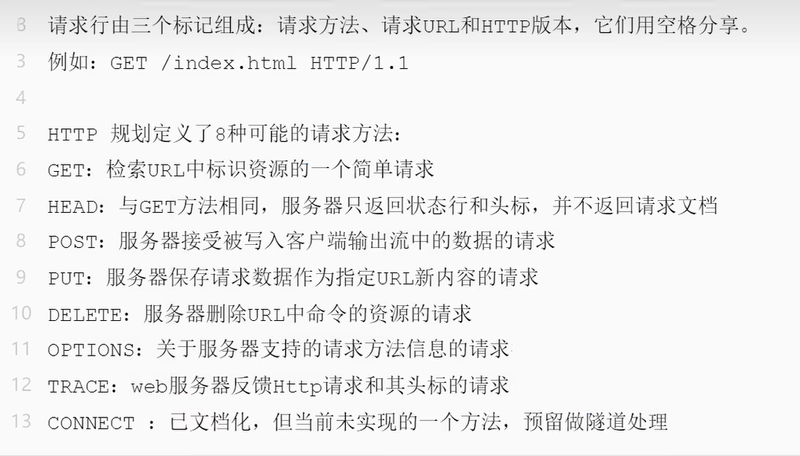
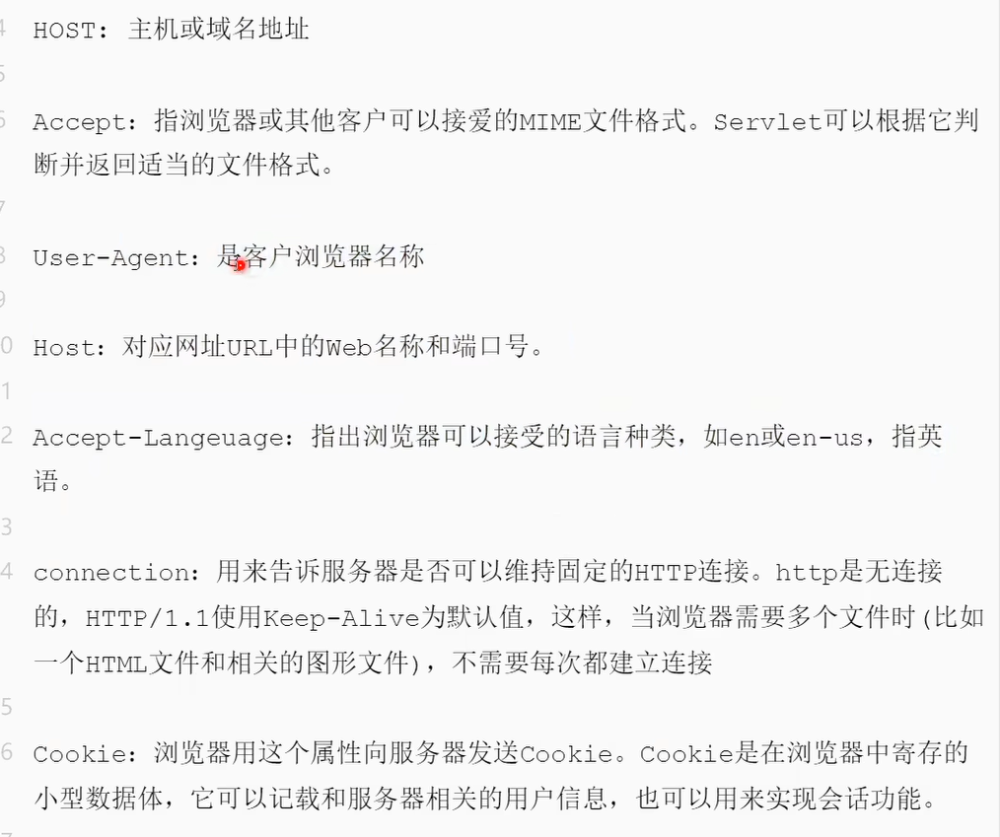
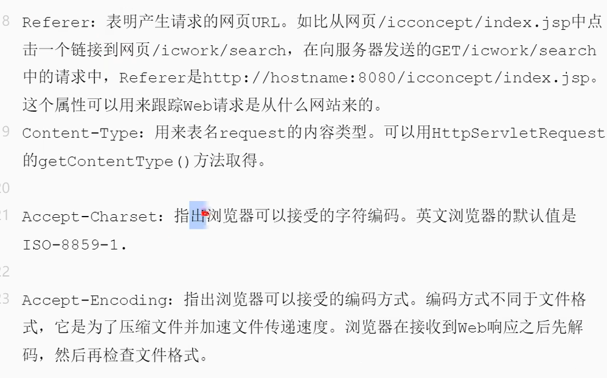

# 渗透


## hosts目录

C:\Windows\System32\drivers\etc

在文件里面添加 1.1.1.1 www.xx.com  ping时就是前面的ip地址

## Http


请求行



请求头






 

## 文件扫描

ip地址访问 跟域名访问有可能 访问的是`不同的文件夹` ip扫描可能是在域名上一级目录 

因为`ip访问`是一个文件夹 而这个文件夹下面可能有`多个项目` 

`域名访问`(域名解析)就会访问到`指定项目`文件夹


## 识别网站信息

### 识别操作系统

#### 使用nmap工具 

```bash
nmap -O 网站域名或者ip地址
```

结果

```tex
Starting Nmap 7.12 ( https://nmap.org ) at 2023-09-09 11:46 ì????ó??á?ê±

Nmap scan report for 43.139.25.222

mass_dns: warning: Unable to determine any DNS servers. Reverse DNS is disabled. Try using --system-dns or specify valid servers with --dns-servers

Host is up (0.037s latency).

Not shown: 993 filtered ports

------------------------------------------------------------------
//下面是开放端口 open就是开放  closed就是未开放 filtered不确定是否开放
PORT     STATE  SERVICE

22/tcp   open   ssh

25/tcp   open   smtp

80/tcp   open   http

110/tcp  open   pop3

143/tcp  open   imap

443/tcp  closed https

3389/tcp closed ms-wbt-server

Device type: general purpose|firewall|storage-misc

Running (JUST GUESSING): Linux 2.6.X|3.X (86%), WatchGuard Fireware 11.X (86%), Synology DiskStation Manager 5.X (85%)

OS CPE: cpe:/o:linux:linux_kernel:2.6.32 cpe:/o:linux:linux_kernel:3.10 cpe:/o:watchguard:fireware:11.8 cpe:/o:linux:linux_kernel cpe:/a:synology:diskstation_manager:5.1
------------------------------------------------------------------
//操作系统的比例
Aggressive OS guesses: Linux 2.6.32 (86%), Linux 2.6.32 or 3.10 (86%), WatchGuard Fireware 11.8 (86%), Synology DiskStation Manager 5.1 (85%), Linux 2.6.35 (85%), Linux 2.6.39 (85%), Linux 3.12 (85%), Linux 3.4 (85%)

No exact OS matches for host (test conditions non-ideal).

OS detection performed. Please report any incorrect results at https://nmap.org/submit/ .

Nmap done: 1 IP address (1 host up) scanned in 11.69 seconds
```


### 识别数据库


#### 查看组合

一般编程语言都有推荐的数据库 直接搜索即可

#### 端口扫描

常见数据库端口

```tex
一、关系型数据库
1、MySql数据库 ，默认端口是: 3306；

2、Oracle数据库 ，默认端口号为：1521；

3、Sql Server数据库 ，默认端口号为：1433；

4、DB2数据库， 默认端口号为：5000；

5、PostgreSQL数据库， 默认端口号为：5432；

6、国产的DM达梦数据库， 默认端口号为：5236。

二、NoSql数据库（非关系型数据库）：
1.Redis数据库，默认端口号：6379；

2.Memcached数据库，默认端口号：11211 ；

3.MongoDB数据库，默认端口号：27017；
```


查看数据库使用的端口

## 信息收集

#### CDN绕过

##### CDN检测

1. 使用超级ping （原理就是模拟全世界各地的访问 如果返回的ip地址都是一个 那么就没有 反之亦然）这里我们先测试bilibili 很明显各地返回的ip地址不是相同的 说明存在CDN
2. 使用cmd工具nslookup （Addresses返回值为好几个 即存在CDN ）

##### 绕过技术

1. 子域名查询
2. 邮件服务查询
3. 国外地址请求
4. 遗留文件，扫描全网
5. 黑暗引擎搜索特定文件（对比文件md5，在其他网站是否存在）（shodan，zoomyey，fofa）
6. dns历史记录，以量打量（将DNS流量打光，就可以直接访问原ip了，不推荐）

**实操网站：xueersi（子域名请求获得真实ip）**

使用超级ping分析，该网站存在CDN，使用www.xueersi.com xueersi.com使用浏览器访问没有区别，但是使用超级ping解析会有区别 有些网站管理员在设置www访问的时候会设置CDN而原域名没使用CND所以直接ping不带www的域名可能直接获得网站主ip

**实操网站：sp910（子域名请求+国外地址访问获得真实ip）**

将当前节点换成了冷门国家访问该网站 大概率就是主ip

**实操网站：mozhe（邮件请求访问获得真实ip）**

在注册的时候 有些网站会发送邮件注册 那么就能通过查看邮箱源代码寻找发送邮箱的ip地址 

但是此时不能完全确定真实ip地址 

使用第三方真实ip查询接口确定其他的ip地址 

如果不相同 进行社工分析 查看网站备案地址 对比查询出来的ip地理位置 

还没完 将对比到的地理位置ip地址 放入本地host文件 后面跟上网站域名 如果能打开网站 说明很大概率能确定是真实ip

**实操网站：50500xl08.cc:59789**

使用python拿到网站的文件hash 放到黑暗引擎上搜索 对比值


# 抓包

针对不同的协议使用不同的工具，http(s)使用的最多，还有tcp协议传输 ，udp协议传输，socket协议传输等等

# 逆向
