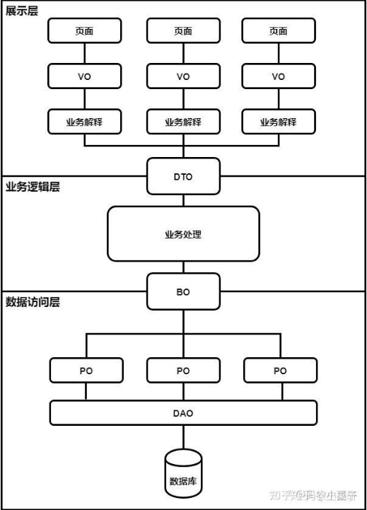

## 需求分析需要的图

### 一、用例图（Use Case Diagram）

1. 用途
   - 用例图主要用于描述系统的功能需求，从用户的角度展示系统的功能和用户与系统的交互。它能够帮助确定系统的边界，明确系统有哪些使用者（参与者）以及他们如何使用系统。
2. 内容
   - 用例图包含参与者（Actor）、用例（Use Case）和它们之间的关系。参与者可以是用户、外部系统等，用例则是系统提供的功能或服务。例如，在一个电商系统中，参与者可能有买家、卖家和管理员，用例可能包括用户注册、商品浏览、下单、支付、发货等。

### 二、数据流图（Data Flow Diagram，DFD）

1. 用途
   - 数据流图用于描述系统中数据的流动和处理过程。它能够帮助分析人员理解系统如何处理输入数据并产生输出数据，以及在这个过程中数据是如何在各个功能模块之间流动的。
2. 内容
   - 数据流图包括外部实体、处理过程、数据存储和数据流。外部实体是系统外部的数据来源或数据去向，处理过程是对数据进行操作的模块，数据存储是数据存放的地方，数据流则表示数据的流动方向。例如，在一个学生成绩管理系统中，外部实体可能是教师和学生，处理过程包括成绩录入、成绩统计、成绩查询等，数据存储可能是成绩数据库，数据流则表示成绩数据如何从教师录入到数据库，再从数据库流向学生进行查询。

### 三、实体 - 关系图（Entity - Relationship Diagram，ERD）

1. 用途
   - 实体 - 关系图主要用于数据库设计，描述系统中的数据对象（实体）以及它们之间的关系。它帮助确定数据库的结构和数据之间的关联方式。
2. 内容
   - ERD 包含实体、属性和关系。实体是具有相同属性的对象的集合，属性是实体的特征，关系则描述了实体之间的联系。例如，在一个图书馆管理系统中，实体可能有书籍、读者和借阅记录，书籍的属性可能包括书名、作者、ISBN 号等，读者的属性可能包括姓名、年龄、联系方式等，借阅记录则表示读者和书籍之间的借阅关系。

### 四、状态图（State Diagram）

1. 用途
   - 状态图用于描述对象在其生命周期内的状态变化以及引起这些变化的事件。它特别适用于具有复杂状态变化的对象，如订单状态、任务状态等。
2. 内容
   - 状态图包括状态、事件和转换。状态是对象在某个时刻的情况，事件是引起状态变化的触发条件，转换则表示从一个状态到另一个状态的变化过程。例如，在一个电商订单系统中，订单的状态可能包括已提交、已支付、已发货、已签收等，事件可能有用户支付、商家发货等，转换则表示订单从已提交状态在用户支付后转换到已支付状态。

### 五、类图（Class Diagram）

1. 用途
   - 类图用于面向对象的系统分析和设计，描述系统中的类、类的属性和方法以及类之间的关系。它帮助确定系统的对象结构和对象之间的协作方式。
2. 内容
   - 类图包括类、属性、方法和关系。类是具有相同属性和方法的对象的抽象，属性是类的特征，方法是类的操作，关系包括继承、关联、聚合和组合等。例如，在一个在线教育系统中，可能有课程类、学生类和教师类，课程类有课程名称、课程时长等属性，有开始授课、结束授课等方法，学生类和课程类之间可能存在选课的关联关系。

这些图在项目需求分析阶段相互配合，能够全面、准确地描述项目的功能、数据、对象和状态等方面的需求，为项目的后续设计和开发提供坚实的基础。

### 六、业务流程图（Business Process Diagram）

1. 用途
   - 业务流程图用于描述企业或组织内的业务流程，它展示了业务活动的先后顺序、涉及的部门或角色、以及业务数据的流向等。通过业务流程图，可以清晰地了解现有业务是如何运作的，发现其中存在的问题和优化点，同时也为项目的功能设计提供依据。
2. 内容
   - 业务流程图通常包含流程的起点和终点、各个处理步骤、决策点、流程分支、以及参与流程的人员或部门等元素。例如，在企业的采购流程中，业务流程图可能会展示需求部门提出采购申请，采购部门进行供应商选择、询价、签订合同，仓库部门进行货物验收、入库等一系列操作，并且在每个步骤中标明相关的负责部门和数据传递情况。

### 七、系统流程图（System Flowchart）

1. 用途
   - 系统流程图主要用于描述系统的物理模型，即系统中的硬件、软件、文件、数据等元素之间的流动和处理关系。它帮助项目团队理解系统的整体架构和运行机制，明确系统各个部分之间的交互方式，在系统设计和开发过程中起到重要的指导作用。
2. 内容
   - 系统流程图包括计算机系统中的各种设备（如服务器、终端、存储设备等）、程序、文件和数据的流向。例如，在一个网络应用系统中，系统流程图可能会展示用户通过浏览器发送请求，请求经过网络到达服务器，服务器上的应用程序处理请求，从数据库中读取或写入数据，最后将处理结果返回给用户浏览器的整个过程。

流程图能够以直观的方式呈现业务或系统的运行逻辑，帮助项目相关人员达成共识，并且有助于发现潜在的逻辑错误和效率问题，是项目需求分析和设计阶段不可或缺的工具。

先对分析需要那些功能模块 >>> 然后设计功能模块的表设计，顺便分析架构

## 包架构模块

### PO

PO是`持久化对象`，用于表示数据库中的实体或表的映射通常与数据库表的结构和字段对应PO的属性对应数据库表的字段，可以进行持久化操作（新增、查询、更新、删除）

### VO

VO是`视图对象`，用于封装数据通常是不可变的，用于传递数据而不包含业务逻辑VO可以用于在不同层之间传递数据，如前端和后端之间，后端的返回的到前端的数据只需要保留必要的字段就可以将这些必要的字段封装起来就是VO

### BO
BO是`业务对象`，用于封装业务逻辑和操作包含与业务相关的方法和属性，用于实现业务规则和操作
BO通常与领域模型紧密相关，用于表示业务概念和业务流程

### DO
DO通常与BO和PO相对应，用于实现领域模型和业务逻辑，用于表示从数据存储中得到的数据

### DAO
DAO是`数据访问对象`，用于封装对数据库的访问操作，也就是我们常说的Dao层提供对数据库的增删改查等操作的接口,DAO可以隐藏底层数据库的具体实现细节，使得业务逻辑层与数据库解耦

### DTO
DTO是`数据传输对象`，用于在不同层之间传输数据通常用于优化数据传输的性能和减少网络通信的开销。DTO可以封装多个对象的数据，以减少网络请求次数。如果说VO一般用于前端和后端之后传输数据，那么DTO就是在后端的不同层之间传递数据，例如controller层和service层或者在服务之间结构调用的时候使用DTO

### POJO
POJO是一个简单的Java对象，没有特定的限制和约束，是一种普通的Java类，不依赖于特定的框架或接口

## 需求分析

分析功能模块有哪些

既然是一个视频播放的项目那么就需要以下模块

1. 用户模块
    - 登录/注册（对外暴露的接口需要验证）
      - 邮箱注册/登录（邮箱注册/登录验证码防刷）
      - 浏览记录&搜索记录
     - 用户浏览视频被存储（用户停留视频多少s才保留记录）
     - 用户搜索记录被记录
      - 收藏夹
     - 可以对视频收藏分类管理
      - 订阅分类（实现推送机制）&关注/粉丝
     - 订阅后推送相似视频
     - 推送关注用户视频 
2. 管理模块
3. 内容审核模块
	- 文本审核（用户昵称，视频标题与描述）（提取出来给所有包含文字审核的做服务：中台服务）
	- 图片审核  (用户头像，视频封面)
	- 视频审核（用户发布的视频）
4. 视频模块
	- 相似视频推送
	
	   - 热度排行榜
	
	   - 分类推送
	
	   - 关注推送
	
	   - 兴趣推送
	
	   - 热门视频推送
	
	   - 相似视频推送 
	
	- 用户互动
		- 用户浏览视频
		- 点赞，收藏，分享和搜索视频 
	
	- 视频管理
		- 发布视频和下架视频
		- 编辑视频描述
		- 播放视频 
5. 资源保护模块（防止流量盗刷）
   - 视频防盗
   - 图片防盗

## 技术选型&架构设计

## 表设计

baseEntity在应用层层面 封装统一字段 Bo继承baseEntity

公共字段：创建时间，修改时间，逻辑删除等等

#### 视频模块

##### 视频表video

视频id 
视频标题 
视频描述 
视频发布用户id 
视频源 文件表id-->通过文件表id获取key（资源地址)
视频封面 文件表id-->通过文件表id获取key（资源地址)
标签 
审核状态：通过审核中 PASS
状态：公开 私密
审核结果：正常，null，审核违规信息
点赞次数
收藏次数 
分享次数 

##### 分类表type

分类id
名称
标签

##### 视频分类中间表video_type

id
分类id
视频id

##### 视频点赞表kudos

id
视频id
点赞用户id

##### 视频分享表share

id
视频id
分享（用户）id
ip 

#### 内容审核模块

##### 系统配置表

自动通过

人工审核

PASS

#### 资源保护模块

##### 文件表

设计这里的时候将 源视频表的视频源，封面字段 更改

id

key

文件类型

文件大小

视频时长

....

#### 用户模块

RBAC（基于角色的访问控制）：将角色与具体的权限绑定（绑定后极少修改），如此某个角色对应有哪些权限（能干什么，不能干什么），然后再给用户分配所需要的角色，这样，每个分配了不同角色的用户也就有了不同的能力。

经典五张表：

##### 用户表user_info

id

昵称

账号

密码

介绍

头像性别

创建时间

##### 用户角色关系表user_role_info

id

用户id

角色id

##### 角色表role_info

id

角色名称

##### 角色权限关系表role_permission_info

id

权限id

角色id

##### 权限表permission_info

id

权限名称

菜单权限

排序

##### 浏览记录

不建议存到本地数据库，用户量大了访问不过来，存到redis中使用zset存储，设置ttl几个星期

##### 搜索记录

也是上述设计

##### 收藏夹表

id

名称

介绍

收藏夹视频数量

创建时间

创建者id（用户id）

##### 收藏夹视频中间表

id

收藏夹id

视频id

##### 订阅分类表

id

用户id

分类id：感兴趣分类id

##### 关注粉丝

id

关注id

粉丝id

## 落地实现

就是具体功能的实现

## 横向考虑

